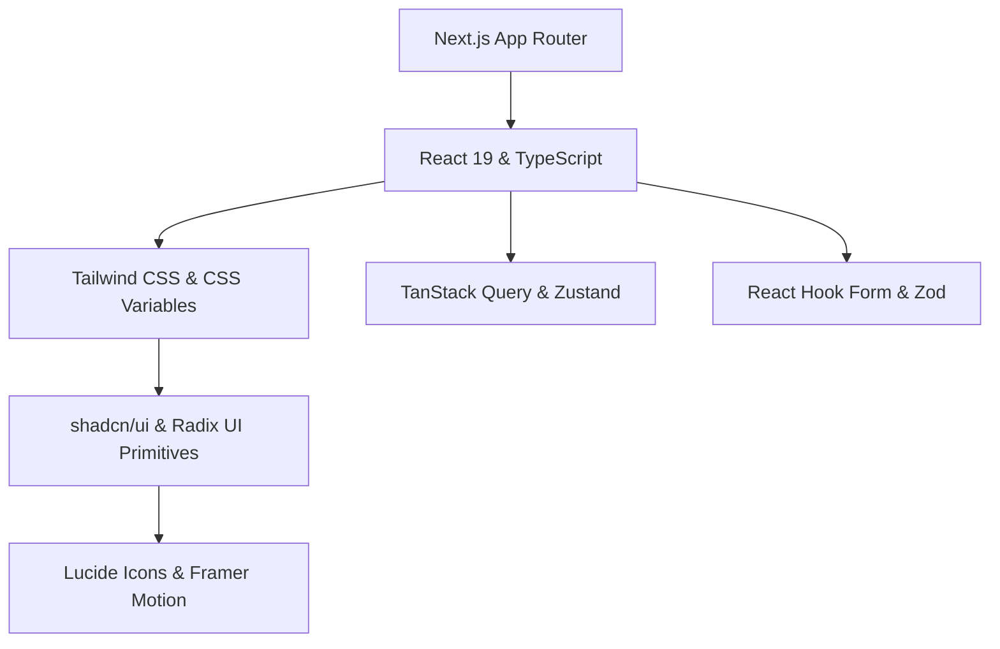

# 🎨 设计系统与架构规范 (`DESIGN.cn.md`)

> **简体中文版 (Simplified Chinese Version)**  
> 单一事实来源 (Single Source of Truth): [English (`DESIGN.md`)](./DESIGN.md) | 其他语言: [Korean (`DESIGN.ko.md`)](./DESIGN.ko.md) | [Japanese (`DESIGN.jp.md`)](./DESIGN.jp.md)

本文档定义了使用 **shadcn/ui**、**Tailwind CSS** 和 **Next.js (App Router)** 构建现代 Web 应用程序的核心架构、设计令牌、组件标准与开发规范。

---

## 📋 目录 (Table of Contents)

1. [核心原则 (Core Principles)](#1-核心原则-core-principles)
2. [技术栈与架构 (Tech Stack & Architecture)](#2-技术栈与架构-tech-stack--architecture)
3. [设计令牌与主题系统 (Design Tokens & Theme System)](#3-设计令牌与主题系统-design-tokens--theme-system)
4. [shadcn/ui 组件架构 (Component Architecture)](#4-shadcnui-组件架构-component-architecture)
5. [布局与响应式策略 (Layout & Responsive Strategy)](#5-布局与响应式策略-layout--responsive-strategy)
6. [状态管理与数据流 (State Management & Data Flow)](#6-状态管理与数据流-state-management--data-flow)
7. [开发规范 (Development Conventions)](#7-开发规范-development-conventions)
8. [初始化与质量检查清单 (Setup & Quality Checklist)](#8-初始化与质量检查清单-setup--quality-checklist)

---

## 1. 核心原则 (Core Principles)

| 原则 | 核心概念 | 实现规则 |
| :--- | :--- | :--- |
| **1. Ownership (代码所有权)** | 掌握源码而非依赖第三方包 | 通过 `shadcn/ui` CLI 直接将组件源码保存在 `components/ui` 中。 |
| **2. Accessibility First (无障碍优先)** | 开箱即用的包容性 UX | 基于 Radix UI Primitives 遵循 WAI-ARIA 标准，严格管理键盘导航与焦点指示。 |
| **3. Token-Driven Styling (令牌驱动样式)** | 零硬编码颜色与尺寸 | 使用 CSS 变量语义令牌 (`var(--primary)`, `var(--background)`) 与 Tailwind 工具类。 |
| **4. Micro-Interactions (微交互)** | 提升感知性能 | 细致的悬停反馈 (`transition-colors`, `active:scale-[0.99]`) 及 Framer Motion 流畅动画。 |
| **5. Composition (组合胜于继承)** | 灵活可扩展的设计 | 采用 Radix `Slot` (`asChild`) 及复合组件模式，代替僵硬的 Prop 接口。 |

---

## 2. 技术栈与架构 (Tech Stack & Architecture)

### 技术栈概览



- **框架**: [Next.js (App Router)](https://nextjs.org/) + [React 19](https://react.dev/) + [TypeScript](https://www.typescriptlang.org/)
- **样式**: [Tailwind CSS](https://tailwindcss.com/) + CSS Variables (OKLCH / HSL)
- **UI 原语**: [shadcn/ui](https://ui.shadcn.com/) / [Radix UI](https://www.radix-ui.com/)
- **工具库**: `clsx` + `tailwind-merge` (`cn()` 辅助函数), `class-variance-authority` (CVA)
- **图标与动画**: [Lucide React](https://lucide.dev/), [Framer Motion](https://www.framer.com/motion/)
- **主题模式**: [next-themes](https://github.com/pacocoursey/next-themes) (Light / Dark / System)
- **表单与校验**: [React Hook Form](https://react-hook-form.com/) + [Zod](https://zod.dev/)

### 目录结构

```text
.
├── app/                      # App Router 页面与布局
│   ├── (dashboard)/          # 应用程序主路由组
│   ├── globals.css           # 全局 CSS 及 CSS 变量令牌定义
│   └── layout.tsx            # 包含 Theme 与 Query Provider 的根布局
├── components/
│   ├── ui/                   # shadcn/ui 原子级原语组件 (button, card, dialog 等)
│   ├── common/               # 业务无关的公共组件 (header, sidebar, mode-toggle)
│   ├── features/             # 特定业务功能的领域组件
│   └── providers/            # React 上下文 Provider
├── hooks/                    # 可复用的自定义 Hooks
├── lib/                      # 工具函数 (utils.ts) 与 Validation 模式
└── types/                    # 共享 TypeScript 类型定义
```

---

## 3. 设计令牌与主题系统 (Design Tokens & Theme System)

### 3.1 OKLCH / HSL 语义颜色令牌

```css
@layer base {
  :root {
    --background: oklch(0.99 0 0);
    --foreground: oklch(0.14 0.005 285.8);
    --card: oklch(1 0 0);
    --card-foreground: oklch(0.14 0.005 285.8);
    --popover: oklch(1 0 0);
    --popover-foreground: oklch(0.14 0.005 285.8);
    --primary: oklch(0.21 0.006 285.8);
    --primary-foreground: oklch(0.98 0 0);
    --secondary: oklch(0.96 0.003 264.5);
    --secondary-foreground: oklch(0.21 0.006 285.8);
    --muted: oklch(0.96 0.003 264.5);
    --muted-foreground: oklch(0.55 0.013 285.8);
    --accent: oklch(0.96 0.003 264.5);
    --accent-foreground: oklch(0.21 0.006 285.8);
    --destructive: oklch(0.57 0.24 27.3);
    --destructive-foreground: oklch(0.98 0 0);
    --border: oklch(0.91 0.005 285.8);
    --input: oklch(0.91 0.005 285.8);
    --ring: oklch(0.70 0.015 285.8);
    --radius: 0.625rem;
  }

  .dark {
    --background: oklch(0.14 0.005 285.8);
    --foreground: oklch(0.98 0 0);
    --card: oklch(0.18 0.006 285.8);
    --card-foreground: oklch(0.98 0 0);
    --popover: oklch(0.18 0.006 285.8);
    --popover-foreground: oklch(0.98 0 0);
    --primary: oklch(0.98 0 0);
    --primary-foreground: oklch(0.21 0.006 285.8);
    --secondary: oklch(0.26 0.006 285.8);
    --secondary-foreground: oklch(0.98 0 0);
    --muted: oklch(0.26 0.006 285.8);
    --muted-foreground: oklch(0.70 0.015 285.8);
    --accent: oklch(0.26 0.006 285.8);
    --accent-foreground: oklch(0.98 0 0);
    --destructive: oklch(0.39 0.14 22.7);
    --destructive-foreground: oklch(0.98 0 0);
    --border: oklch(0.26 0.006 285.8);
    --input: oklch(0.26 0.006 285.8);
    --ring: oklch(0.44 0.01 285.8);
  }
}
```

### 3.2 字体与圆角阶梯 (Typography & Radius Scale)

- **字体**: Inter / Outfit (Sans 无衬线), Fira Code / JetBrains Mono (Code 等宽).
- **圆角令牌**: `rounded-lg: var(--radius)`, `rounded-md: calc(var(--radius) - 2px)`, `rounded-sm: calc(var(--radius) - 4px)`.

---

## 4. shadcn/ui 组件架构

### 4.1 类名组合 (`cn()`) 与 CVA 模式

```typescript
// lib/utils.ts
import { clsx, type ClassValue } from "clsx";
import { twMerge } from "tailwind-merge";

export function cn(...inputs: ClassValue[]) {
  return twMerge(clsx(inputs));
}
```

```typescript
// CVA Variant 示例
const buttonVariants = cva(
  "inline-flex items-center justify-center whitespace-nowrap rounded-md text-sm font-medium transition-colors focus-visible:outline-none focus-visible:ring-1 focus-visible:ring-ring disabled:pointer-events-none disabled:opacity-50 [&_svg]:pointer-events-none [&_svg]:size-4 [&_svg]:shrink-0 gap-2",
  {
    variants: {
      variant: {
        default: "bg-primary text-primary-foreground shadow hover:bg-primary/90",
        destructive: "bg-destructive text-destructive-foreground shadow-sm hover:bg-destructive/90",
        outline: "border border-input bg-background shadow-sm hover:bg-accent hover:text-accent-foreground",
        secondary: "bg-secondary text-secondary-foreground shadow-sm hover:bg-secondary/80",
        ghost: "hover:bg-accent hover:text-accent-foreground",
        link: "text-primary underline-offset-4 hover:underline",
      },
      size: {
        default: "h-9 px-4 py-2",
        sm: "h-8 rounded-md px-3 text-xs",
        lg: "h-10 rounded-md px-8",
        icon: "h-9 w-9",
      },
    },
    defaultVariants: { variant: "default", size: "default" },
  }
);
```

### 4.2 多态性 (`asChild`)

使用 Radix `Slot` (通过 `asChild`) 可避免产生无意义的 DOM 封装，直接将样式与事件传递给子元素：

```tsx
<Button asChild variant="outline">
  <Link href="/dashboard">前往控制台</Link>
</Button>
```

### 4.3 核心组件目录

| 分类 | 核心组件 | 使用场景 |
| :--- | :--- | :--- |
| **Form & Controls** | `Button`, `Input`, `Select`, `Checkbox`, `RadioGroup`, `Switch`, `Slider`, `Form` | 用户输入与校验 |
| **Overlays & Dialogs** | `Dialog`, `Sheet`, `AlertDialog`, `Popover`, `DropdownMenu`, `Tooltip` | 模态框、侧边抽屉与气泡弹出层 |
| **Layout & Containers** | `Card`, `Sidebar`, `Accordion`, `Tabs`, `ScrollArea`, `Separator` | 页面框架与内容结构化 |
| **Navigation** | `NavigationMenu`, `Breadcrumb`, `Pagination`, `Command` (`Cmd+K`) | 导航菜单与快捷命令面板 |
| **Data & Feedback** | `Table`, `Avatar`, `Badge`, `Skeleton`, `Sonner` (Toast), `Chart` | 数据可视化与异步反馈通知 |

---

## 5. 布局与响应式策略

### 5.1 App Shell 架构

```tsx
// app/(dashboard)/layout.tsx
import { SidebarProvider, SidebarTrigger } from "@/components/ui/sidebar";
import { AppSidebar } from "@/components/common/app-sidebar";

export default function DashboardLayout({ children }: { children: React.ReactNode }) {
  return (
    <SidebarProvider defaultOpen>
      <div className="flex min-h-screen w-full bg-background text-foreground">
        <AppSidebar />
        <div className="flex flex-1 flex-col overflow-hidden">
          <header className="flex h-16 items-center justify-between border-b px-6 bg-card/80 backdrop-blur-md sticky top-0 z-30">
            <SidebarTrigger />
          </header>
          <main className="flex-1 overflow-y-auto p-6 md:p-8">
            <div className="mx-auto max-w-7xl space-y-6">{children}</div>
          </main>
        </div>
      </div>
    </SidebarProvider>
  );
}
```

### 5.2 断点矩阵 (Breakpoints Matrix)

| 断点 | 宽度 | 布局策略 |
| :--- | :--- | :--- |
| **`sm`** | `>= 640px` | 表单 2 列布局 |
| **`md`** | `>= 768px` | 固定侧边栏面板 (隐藏移动端 `Sheet`), 卡片 2 列布局 |
| **`lg`** | `>= 1024px` | 3 列网格，扩展数据表格列 |
| **`xl`** | `>= 1280px` | 主容器最大宽度居中对齐 (`max-w-7xl`) |

---

## 6. 状态管理与数据流

### 6.1 Server 与 Client 边界

- **Server Components (默认)**: 直接进行 DB/API 数据获取，客户端 Bundle 零占用，利于 SEO。
- **Client Components (`"use client"`)**: 交互状态 (`useState`)、事件处理函数 (`onClick`)、Radix UI 气泡与弹窗。

### 6.2 表单处理模式 (React Hook Form + Zod)

```tsx
"use client";

import { useForm } from "react-hook-form";
import { zodResolver } from "@hookform/resolvers/zod";
import * as z from "zod";
import { Form, FormField, FormItem, FormLabel, FormControl, FormMessage } from "@/components/ui/form";
import { Input } from "@/components/ui/input";
import { Button } from "@/components/ui/button";

const schema = z.object({
  username: z.string().min(2, "至少需要输入 2 个字符"),
});

export function ProfileForm() {
  const form = useForm<z.infer<typeof schema>>({
    resolver: zodResolver(schema),
    defaultValues: { username: "" },
  });

  return (
    <Form {...form}>
      <form onSubmit={form.handleSubmit(console.log)} className="space-y-4">
        <FormField
          control={form.control}
          name="username"
          render={({ field }) => (
            <FormItem>
              <FormLabel>用户名</FormLabel>
              <FormControl><Input {...field} /></FormControl>
              <FormMessage />
            </FormItem>
          )}
        />
        <Button type="submit">保存</Button>
      </form>
    </Form>
  );
}
```

---

## 7. 开发规范

1. **命名规范**: 文件名使用 `kebab-case` (`user-card.tsx`)，组件使用 `PascalCase` (`UserCard`)，Hooks 使用 `camelCase` (`useDebounce`)。
2. **组件 Ref 转发**: 自定义组件需使用 `React.forwardRef` 包裹并设置 `displayName`。
3. **Git 提交格式**: 遵循 [Conventional Commits](https://www.conventionalcommits.org/) 规范 (`feat:`, `fix:`, `docs:`, `style:`, `refactor:`, `chore:`)。

---

## 8. 初始化与质量检查清单

### CLI 快速安装命令

```bash
npx create-next-app@latest my-app --typescript --tailwind --eslint --app --import-alias="@/*"
npx shadcn@latest init
npx shadcn@latest add button card dialog form input select sidebar sonner table tabs
npm install lucide-react next-themes zod react-hook-form @hookform/resolvers class-variance-authority clsx tailwind-merge
```

### 质量审计检查清单

- [ ] **Type Safety**: 零 `any` 类型使用。
- [ ] **Theme Compliance**: 浅色与深色模式下具备良好的对比度 (>= 4.5:1)。
- [ ] **Accessibility (a11y)**: 完整的键盘导航支持，图标按钮包含 `sr-only` 文本。
- [ ] **Responsive Design**: 在所有屏幕尺寸下无水平溢出 (Overflow)。
- [ ] **Token Usage**: 仅使用 CSS 语义变量 (`bg-background`, `text-foreground`)。
- [ ] **Polymorphism**: 链接与按钮组件正确应用了 `asChild` 模式。
