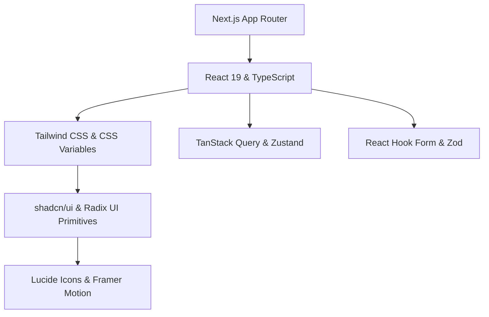

# 🎨 デザインシステム & アーキテクチャ仕様書 (`DESIGN.jp.md`)

> **日本語版 (Japanese Version)**  
> 信頼できる唯一の情報源 (Single Source of Truth): [English (`DESIGN.md`)](./DESIGN.md) | 他の言語: [Korean (`DESIGN.ko.md`)](./DESIGN.ko.md) | [Simplified Chinese (`DESIGN.cn.md`)](./DESIGN.cn.md)

本書は、**shadcn/ui**、**Tailwind CSS**、および **Next.js (App Router)** を活用してモダンな Web アプリケーションを構築するためのコアアーキテクチャ、デザイン設定（トークン）、コンポーネント標準、および開発規約を定義します。

---

## 📋 目次 (Table of Contents)

1. [基本原則 (Core Principles)](#1-基本原則-core-principles)
2. [技術スタックとアーキテクチャ (Tech Stack & Architecture)](#2-技術スタックとアーキテクチャ-tech-stack--architecture)
3. [デザイン設定とテーマシステム (Design Tokens & Theme System)](#3-デザイン設定とテーマシステム-design-tokens--theme-system)
4. [shadcn/ui コンポーネントアーキテクチャ (Component Architecture)](#4-shadcnui-コンポーネントアーキテクチャ-component-architecture)
5. [レイアウトとレスポンシブ戦略 (Layout & Responsive Strategy)](#5-レイアウトとレスポンシブ戦略-layout--responsive-strategy)
6. [状態管理とデータフロー (State Management & Data Flow)](#6-状態管理とデータフロー-state-management--data-flow)
7. [開発規約 (Development Conventions)](#7-개발-規約-development-conventions)
8. [セットアップと品質チェックリスト (Setup & Quality Checklist)](#8-セットアップと品質チェックリスト-setup--quality-checklist)

---

## 1. 基本原則 (Core Principles)

| 原則 | コアコンセプト | 実装ルール |
| :--- | :--- | :--- |
| **1. Ownership (コード所有権)** | パッケージ依存からの脱却とコード所有 | `shadcn/ui` CLI を使用し、コンポーネントソースコードを `components/ui` 内で直接所有・管理します。 |
| **2. Accessibility First (アクセシビリティ最優先)** | 標準搭載されたインクルーシブ UX | Radix UI Primitives に基づく WAI-ARIA 標準、キーボードナビゲーションおよびフォーカス管理を遵守。 |
| **3. Token-Driven Styling (トークン駆動スタイル)** | カラーと数値のハードコーディング禁止 | CSS 変数のセマンティックトークン (`var(--primary)`, `var(--background)`) と Tailwind ユーティリティクラスを使用。 |
| **4. Micro-Interactions (マイクロインタラクション)** | 体感パフォーマンスの向上 | 繊細なホバーフィードバック (`transition-colors`, `active:scale-[0.99]`) と Framer Motion による滑らかなアニメーション。 |
| **5. Composition (合成指向設計)** | 柔軟で拡張可能な設計 | 固定的な Props 設定の代わりに Radix `Slot` (`asChild`) および複合コンポーネントパターンを採用。 |

---

## 2. 技術スタックとアーキテクチャ (Tech Stack & Architecture)

### 技術スタック概要



- **フレームワーク**: [Next.js (App Router)](https://nextjs.org/) + [React 19](https://react.dev/) + [TypeScript](https://www.typescriptlang.org/)
- **スタイリング**: [Tailwind CSS](https://tailwindcss.com/) + CSS Variables (OKLCH / HSL)
- **UI 原形**: [shadcn/ui](https://ui.shadcn.com/) / [Radix UI](https://www.radix-ui.com/)
- **ユーティリティ**: `clsx` + `tailwind-merge` (`cn()` ヘルパー), `class-variance-authority` (CVA)
- **アイコンとモーション**: [Lucide React](https://lucide.dev/), [Framer Motion](https://www.framer.com/motion/)
- **テーマ切替**: [next-themes](https://github.com/pacocoursey/next-themes) (Light / Dark / System)
- **フォームと検証**: [React Hook Form](https://react-hook-form.com/) + [Zod](https://zod.dev/)

### ディレクトリ構造

```text
.
├── app/                      # App Router ページとレイアウト
│   ├── (dashboard)/          # メインアプリケーションルートグループ
│   ├── globals.css           # グローバル CSS および CSS 変数トークン定義
│   └── layout.tsx            # Theme や Query Provider を含む Root layout
├── components/
│   ├── ui/                   # shadcn/ui 原子レベルコンポーネント (button, card, dialog など)
│   ├── common/               # ドメインに依存しない共通コンポーネント (header, sidebar, mode-toggle)
│   ├── features/             # ドメイン特有の機能コンポーネント
│   └── providers/            # React コンテキスト Provider
├── hooks/                    # 再利用可能なカスタムフック
├── lib/                      # ユーティリティ (utils.ts) と Validation スキーマ
└── types/                    # 共有 TypeScript 型定義
```

---

## 3. デザイン設定とテーマシステム (Design Tokens & Theme System)

### 3.1 OKLCH / HSL セマンティックカラー設定

```css
@layer base {
  :root {
    --background: oklch(0.99 0 0);
    --foreground: oklch(0.14 0.005 285.8);
    --card: oklch(1 0 0);
    --card-foreground: oklch(0.14 0.005 285.8);
    --popover: oklch(1 0 0);
    --popover-foreground: oklch(0.14 0.005 285.8);
    --primary: oklch(0.21 0.006 285.8);
    --primary-foreground: oklch(0.98 0 0);
    --secondary: oklch(0.96 0.003 264.5);
    --secondary-foreground: oklch(0.21 0.006 285.8);
    --muted: oklch(0.96 0.003 264.5);
    --muted-foreground: oklch(0.55 0.013 285.8);
    --accent: oklch(0.96 0.003 264.5);
    --accent-foreground: oklch(0.21 0.006 285.8);
    --destructive: oklch(0.57 0.24 27.3);
    --destructive-foreground: oklch(0.98 0 0);
    --border: oklch(0.91 0.005 285.8);
    --input: oklch(0.91 0.005 285.8);
    --ring: oklch(0.70 0.015 285.8);
    --radius: 0.625rem;
  }

  .dark {
    --background: oklch(0.14 0.005 285.8);
    --foreground: oklch(0.98 0 0);
    --card: oklch(0.18 0.006 285.8);
    --card-foreground: oklch(0.98 0 0);
    --popover: oklch(0.18 0.006 285.8);
    --popover-foreground: oklch(0.98 0 0);
    --primary: oklch(0.98 0 0);
    --primary-foreground: oklch(0.21 0.006 285.8);
    --secondary: oklch(0.26 0.006 285.8);
    --secondary-foreground: oklch(0.98 0 0);
    --muted: oklch(0.26 0.006 285.8);
    --muted-foreground: oklch(0.70 0.015 285.8);
    --accent: oklch(0.26 0.006 285.8);
    --accent-foreground: oklch(0.98 0 0);
    --destructive: oklch(0.39 0.14 22.7);
    --destructive-foreground: oklch(0.98 0 0);
    --border: oklch(0.26 0.006 285.8);
    --input: oklch(0.26 0.006 285.8);
    --ring: oklch(0.44 0.01 285.8);
  }
}
```

### 3.2 タイポグラフィと Border Radius スケール

- **フォント**: Inter / Outfit (Sans サンセリフ), Fira Code / JetBrains Mono (Code 等幅).
- **Radius トークン**: `rounded-lg: var(--radius)`, `rounded-md: calc(var(--radius) - 2px)`, `rounded-sm: calc(var(--radius) - 4px)`.

---

## 4. shadcn/ui コンポーネントアーキテクチャ

### 4.1 クラス合成 (`cn()`) と CVA パターン

```typescript
// lib/utils.ts
import { clsx, type ClassValue } from "clsx";
import { twMerge } from "tailwind-merge";

export function cn(...inputs: ClassValue[]) {
  return twMerge(clsx(inputs));
}
```

```typescript
// CVA Variant の例
const buttonVariants = cva(
  "inline-flex items-center justify-center whitespace-nowrap rounded-md text-sm font-medium transition-colors focus-visible:outline-none focus-visible:ring-1 focus-visible:ring-ring disabled:pointer-events-none disabled:opacity-50 [&_svg]:pointer-events-none [&_svg]:size-4 [&_svg]:shrink-0 gap-2",
  {
    variants: {
      variant: {
        default: "bg-primary text-primary-foreground shadow hover:bg-primary/90",
        destructive: "bg-destructive text-destructive-foreground shadow-sm hover:bg-destructive/90",
        outline: "border border-input bg-background shadow-sm hover:bg-accent hover:text-accent-foreground",
        secondary: "bg-secondary text-secondary-foreground shadow-sm hover:bg-secondary/80",
        ghost: "hover:bg-accent hover:text-accent-foreground",
        link: "text-primary underline-offset-4 hover:underline",
      },
      size: {
        default: "h-9 px-4 py-2",
        sm: "h-8 rounded-md px-3 text-xs",
        lg: "h-10 rounded-md px-8",
        icon: "h-9 w-9",
      },
    },
    defaultVariants: { variant: "default", size: "default" },
  }
);
```

### 4.2 ポリモーフィズム (多態性: `asChild`)

不要な DOM ラッパーを作成せずに子要素へスタイルとプロパティを直に委譲するには、Radix `Slot` (`asChild`) を使用します:

```tsx
<Button asChild variant="outline">
  <Link href="/dashboard">ダッシュボードへ移動</Link>
</Button>
```

### 4.3 必須コンポーネントカタログ

| カテゴリ | 主要コンポーネント | 使用目的 |
| :--- | :--- | :--- |
| **Form & Controls** | `Button`, `Input`, `Select`, `Checkbox`, `RadioGroup`, `Switch`, `Slider`, `Form` | フォーム入力およびバリデーション |
| **Overlays & Dialogs** | `Dialog`, `Sheet`, `AlertDialog`, `Popover`, `DropdownMenu`, `Tooltip` | モーダル、サイドドロワー、コンテキストメニュー |
| **Layout & Containers** | `Card`, `Sidebar`, `Accordion`, `Tabs`, `ScrollArea`, `Separator` | レイアウト枠組みと情報構造化 |
| **Navigation** | `NavigationMenu`, `Breadcrumb`, `Pagination`, `Command` (`Cmd+K`) | ナビゲーションおよびコマンドパレット |
| **Data & Feedback** | `Table`, `Avatar`, `Badge`, `Skeleton`, `Sonner` (Toast), `Chart` | データ視覚化および非同期通知 |

---

## 5. レイアウトとレスポンシブ戦略

### 5.1 App Shell アーキテクチャ

```tsx
// app/(dashboard)/layout.tsx
import { SidebarProvider, SidebarTrigger } from "@/components/ui/sidebar";
import { AppSidebar } from "@/components/common/app-sidebar";

export default function DashboardLayout({ children }: { children: React.ReactNode }) {
  return (
    <SidebarProvider defaultOpen>
      <div className="flex min-h-screen w-full bg-background text-foreground">
        <AppSidebar />
        <div className="flex flex-1 flex-col overflow-hidden">
          <header className="flex h-16 items-center justify-between border-b px-6 bg-card/80 backdrop-blur-md sticky top-0 z-30">
            <SidebarTrigger />
          </header>
          <main className="flex-1 overflow-y-auto p-6 md:p-8">
            <div className="mx-auto max-w-7xl space-y-6">{children}</div>
          </main>
        </div>
      </div>
    </SidebarProvider>
  );
}
```

### 5.2 Breakpoints マトリクス

| Breakpoint | 幅 | レイアウト戦略 |
| :--- | :--- | :--- |
| **`sm`** | `>= 640px` | フォーム 2 列配置 |
| **`md`** | `>= 768px` | 固定サイドバーパネル (モバイル `Sheet` 非表示)、カード 2 列配置 |
| **`lg`** | `>= 1024px` | 3 列グリッド、データテーブルのカラム拡張 |
| **`xl`** | `>= 1280px` | メインコンテナ最大幅中央揃え (`max-w-7xl`) |

---

## 6. 状態管理とデータフロー

### 6.1 Server vs Client 境界

- **Server Components (デフォルト)**: DB/API 直接フェッチ、クライアントバンドルサイズ 0、SEO 最適化。
- **Client Components (`"use client"`)**: インタラクティブ状態 (`useState`)、イベントハンドラ (`onClick`)、Radix UI ポップアップ。

### 6.2 フォーム処理パターン (React Hook Form + Zod)

```tsx
"use client";

import { useForm } from "react-hook-form";
import { zodResolver } from "@hookform/resolvers/zod";
import * as z from "zod";
import { Form, FormField, FormItem, FormLabel, FormControl, FormMessage } from "@/components/ui/form";
import { Input } from "@/components/ui/input";
import { Button } from "@/components/ui/button";

const schema = z.object({
  username: z.string().min(2, "2文字以上入力してください。"),
});

export function ProfileForm() {
  const form = useForm<z.infer<typeof schema>>({
    resolver: zodResolver(schema),
    defaultValues: { username: "" },
  });

  return (
    <Form {...form}>
      <form onSubmit={form.handleSubmit(console.log)} className="space-y-4">
        <FormField
          control={form.control}
          name="username"
          render={({ field }) => (
            <FormItem>
              <FormLabel>ユーザー名</FormLabel>
              <FormControl><Input {...field} /></FormControl>
              <FormMessage />
            </FormItem>
          )}
        />
        <Button type="submit">保存</Button>
      </form>
    </Form>
  );
}
```

---

## 7. 開発規約

1. **命名規約**: ファイル名 `kebab-case` (`user-card.tsx`)、コンポーネント `PascalCase` (`UserCard`)、フック `camelCase` (`useDebounce`)。
2. **Component Ref Forwarding**: カスタムコンポーネントは `React.forwardRef` で包み `displayName` を設定します。
3. **Git コミット**: [Conventional Commits](https://www.conventionalcommits.org/) 準拠 (`feat:`, `fix:`, `docs:`, `style:`, `refactor:`, `chore:`)。

---

## 8. セットアップと品質チェックリスト

### CLI 初期化コマンド

```bash
npx create-next-app@latest my-app --typescript --tailwind --eslint --app --import-alias="@/*"
npx shadcn@latest init
npx shadcn@latest add button card dialog form input select sidebar sonner table tabs
npm install lucide-react next-themes zod react-hook-form @hookform/resolvers class-variance-authority clsx tailwind-merge
```

### 品質監査チェックリスト

- [ ] **Type Safety**: `any` 型の完全排除。
- [ ] **Theme Compliance**: ライト・ダークモードでの良好なコントラスト比 (>= 4.5:1)。
- [ ] **Accessibility (a11y)**: 完全なキーボードナビゲーション & アイコンボタンへの `sr-only` テキスト付与。
- [ ] **Responsive Design**: 全画面サイズでの横スクロール (Overflow) 発生なし。
- [ ] **Token Usage**: CSS セマンティック変数の使用 (`bg-background`, `text-foreground`)。
- [ ] **Polymorphism**: リンクおよびボタンへの `asChild` の適切な適用。
