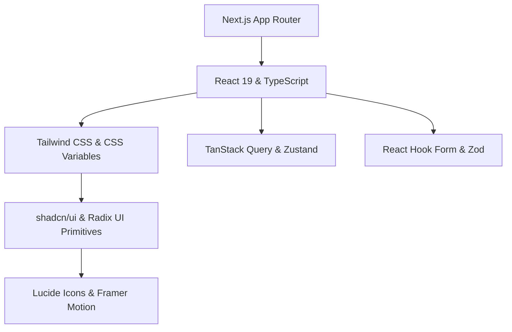

# 🎨 디자인 시스템 & 아키텍처 명세서 (`DESIGN.ko.md`)

> **한국어 번역본 (Korean Version)**  
> 원본(Single Source of Truth): [English (`DESIGN.md`)](./DESIGN.md) | 기타 번역: [Simplified Chinese (`DESIGN.cn.md`)](./DESIGN.cn.md) | [Japanese (`DESIGN.jp.md`)](./DESIGN.jp.md)

본 문서는 **shadcn/ui**, **Tailwind CSS**, **Next.js (App Router)**를 활용하여 모던 웹 애플리케이션을 구축하기 위한 핵심 아키텍처, 디자인 토큰, 컴포넌트 표준 및 개발 컨벤션을 정의합니다.

---

## 📋 목차 (Table of Contents)

1. [핵심 원칙 (Core Principles)](#1-핵심-원칙-core-principles)
2. [기술 스택 및 아키텍처 (Tech Stack & Architecture)](#2-기술-스택-및-아키텍처-tech-stack--architecture)
3. [디자인 토큰 & 테마 시스템 (Design Tokens & Theme System)](#3-디자인-토큰--테마-시스템-design-tokens--theme-system)
4. [shadcn/ui 컴포넌트 아키텍처 (Component Architecture)](#4-shadcnui-컴포넌트-아키텍처-component-architecture)
5. [레이아웃 & 반응형 전략 (Layout & Responsive Strategy)](#5-레이아웃--반응형-전략-layout--responsive-strategy)
6. [상태 관리 & 데이터 흐름 (State Management & Data Flow)](#6-상태-관리--데이터-흐름-state-management--data-flow)
7. [개발 컨벤션 (Development Conventions)](#7-개발-컨벤션-development-conventions)
8. [셋업 & 품질 체크리스트 (Setup & Quality Checklist)](#8-셋업--품질-체크리스트-setup--quality-checklist)

---

## 1. 핵심 원칙 (Core Principles)

| 원칙 | 핵심 개념 | 구현 규칙 |
| :--- | :--- | :--- |
| **1. Ownership (소유권)** | 패키지 의존성 탈피 및 코드 소유 | `shadcn/ui` CLI를 통해 컴포넌트 소스 코드를 `components/ui`에 직접 소유합니다. |
| **2. Accessibility First (접근성)** | 기본 탑재된 포용적 UX | Radix UI Primitives 기반 WAI-ARIA 표준, 키보드 내비게이션 및 포커스 관리 준수. |
| **3. Token-Driven Styling (토큰 바인딩)** | 하드코딩 색상/수치 금지 | CSS 변수 시맨틱 토큰(`var(--primary)`, `var(--background)`) 및 Tailwind 유틸리티 클래스 사용. |
| **4. Micro-Interactions (생동감)** | 체감 성능 향상 | 은은한 호버 피드백(`transition-colors`, `active:scale-[0.99]`) 및 Framer Motion 애니메이션 적용. |
| **5. Composition (조합성)** | 유연하고 확장 가능한 설계 | 고정된 Props 설정 대신 Radix `Slot` (`asChild`) 및 조합 컴포넌트 패턴 채택. |

---

## 2. 기술 스택 및 아키텍처 (Tech Stack & Architecture)

### 기술 스택 개요



- **프레임워크**: [Next.js (App Router)](https://nextjs.org/) + [React 19](https://react.dev/) + [TypeScript](https://www.typescriptlang.org/)
- **스타일링**: [Tailwind CSS](https://tailwindcss.com/) + CSS Variables (OKLCH / HSL)
- **UI 원형**: [shadcn/ui](https://ui.shadcn.com/) / [Radix UI](https://www.radix-ui.com/)
- **유틸리티**: `clsx` + `tailwind-merge` (`cn()` 헬퍼), `class-variance-authority` (CVA)
- **아이콘 & 모션**: [Lucide React](https://lucide.dev/), [Framer Motion](https://www.framer.com/motion/)
- **테마**: [next-themes](https://github.com/pacocoursey/next-themes) (Light / Dark / System)
- **폼 & 검증**: [React Hook Form](https://react-hook-form.com/) + [Zod](https://zod.dev/)

### 디렉토리 구조

```text
.
├── app/                      # App Router 페이지 및 레이아웃
│   ├── (dashboard)/          # 메인 애플리케이션 라우트 그룹
│   ├── globals.css           # 전역 CSS 및 CSS 변수 토큰 정의
│   └── layout.tsx            # Theme & Query Provider가 포함된 Root layout
├── components/
│   ├── ui/                   # 원자적 shadcn/ui primitives (button, card, dialog 등)
│   ├── common/               # 도메인 독립적 공통 컴포넌트 (header, sidebar, mode-toggle)
│   ├── features/             # 도메인 특화 기능 컴포넌트
│   └── providers/            # React context providers
├── hooks/                    # 재사용 가능한 커스텀 훅
├── lib/                      # 유틸리티 (utils.ts) & 검증 스키마
└── types/                    # 공통 TypeScript 타입 선언
```

---

## 3. 디자인 토큰 & 테마 시스템 (Design Tokens & Theme System)

### 3.1 OKLCH / HSL 시맨틱 색상 토큰

```css
@layer base {
  :root {
    --background: oklch(0.99 0 0);
    --foreground: oklch(0.14 0.005 285.8);
    --card: oklch(1 0 0);
    --card-foreground: oklch(0.14 0.005 285.8);
    --popover: oklch(1 0 0);
    --popover-foreground: oklch(0.14 0.005 285.8);
    --primary: oklch(0.21 0.006 285.8);
    --primary-foreground: oklch(0.98 0 0);
    --secondary: oklch(0.96 0.003 264.5);
    --secondary-foreground: oklch(0.21 0.006 285.8);
    --muted: oklch(0.96 0.003 264.5);
    --muted-foreground: oklch(0.55 0.013 285.8);
    --accent: oklch(0.96 0.003 264.5);
    --accent-foreground: oklch(0.21 0.006 285.8);
    --destructive: oklch(0.57 0.24 27.3);
    --destructive-foreground: oklch(0.98 0 0);
    --border: oklch(0.91 0.005 285.8);
    --input: oklch(0.91 0.005 285.8);
    --ring: oklch(0.70 0.015 285.8);
    --radius: 0.625rem;
  }

  .dark {
    --background: oklch(0.14 0.005 285.8);
    --foreground: oklch(0.98 0 0);
    --card: oklch(0.18 0.006 285.8);
    --card-foreground: oklch(0.98 0 0);
    --popover: oklch(0.18 0.006 285.8);
    --popover-foreground: oklch(0.98 0 0);
    --primary: oklch(0.98 0 0);
    --primary-foreground: oklch(0.21 0.006 285.8);
    --secondary: oklch(0.26 0.006 285.8);
    --secondary-foreground: oklch(0.98 0 0);
    --muted: oklch(0.26 0.006 285.8);
    --muted-foreground: oklch(0.70 0.015 285.8);
    --accent: oklch(0.26 0.006 285.8);
    --accent-foreground: oklch(0.98 0 0);
    --destructive: oklch(0.39 0.14 22.7);
    --destructive-foreground: oklch(0.98 0 0);
    --border: oklch(0.26 0.006 285.8);
    --input: oklch(0.26 0.006 285.8);
    --ring: oklch(0.44 0.01 285.8);
  }
}
```

### 3.2 타이포그래피 & Radius 스케일

- **폰트**: Inter / Outfit (Sans), Fira Code / JetBrains Mono (Code).
- **Radius 토큰**: `rounded-lg: var(--radius)`, `rounded-md: calc(var(--radius) - 2px)`, `rounded-sm: calc(var(--radius) - 4px)`.

---

## 4. shadcn/ui 컴포넌트 아키텍처

### 4.1 클래스 합성 (`cn()`) & CVA 패턴

```typescript
// lib/utils.ts
import { clsx, type ClassValue } from "clsx";
import { twMerge } from "tailwind-merge";

export function cn(...inputs: ClassValue[]) {
  return twMerge(clsx(inputs));
}
```

```typescript
// CVA Variant 예시
const buttonVariants = cva(
  "inline-flex items-center justify-center whitespace-nowrap rounded-md text-sm font-medium transition-colors focus-visible:outline-none focus-visible:ring-1 focus-visible:ring-ring disabled:pointer-events-none disabled:opacity-50 [&_svg]:pointer-events-none [&_svg]:size-4 [&_svg]:shrink-0 gap-2",
  {
    variants: {
      variant: {
        default: "bg-primary text-primary-foreground shadow hover:bg-primary/90",
        destructive: "bg-destructive text-destructive-foreground shadow-sm hover:bg-destructive/90",
        outline: "border border-input bg-background shadow-sm hover:bg-accent hover:text-accent-foreground",
        secondary: "bg-secondary text-secondary-foreground shadow-sm hover:bg-secondary/80",
        ghost: "hover:bg-accent hover:text-accent-foreground",
        link: "text-primary underline-offset-4 hover:underline",
      },
      size: {
        default: "h-9 px-4 py-2",
        sm: "h-8 rounded-md px-3 text-xs",
        lg: "h-10 rounded-md px-8",
        icon: "h-9 w-9",
      },
    },
    defaultVariants: { variant: "default", size: "default" },
  }
);
```

### 4.2 다형성 (`asChild`)

불필요한 DOM 래퍼 없이 자식 요소에 스타일과 속성을 직접 위임하려면 `asChild` (Radix `Slot`)를 사용합니다:

```tsx
<Button asChild variant="outline">
  <Link href="/dashboard">대시보드로 이동</Link>
</Button>
```

### 4.3 필수 컴포넌트 카탈로그

| 카테고리 | 핵심 컴포넌트 | 사용 목적 |
| :--- | :--- | :--- |
| **Form & Controls** | `Button`, `Input`, `Select`, `Checkbox`, `RadioGroup`, `Switch`, `Slider`, `Form` | 사용자 입력 폼 및 검증 |
| **Overlays & Dialogs** | `Dialog`, `Sheet`, `AlertDialog`, `Popover`, `DropdownMenu`, `Tooltip` | 대화상자, 모달, 드로어 오버레이 |
| **Layout & Containers** | `Card`, `Sidebar`, `Accordion`, `Tabs`, `ScrollArea`, `Separator` | 레이아웃 프레임 및 정보 구조화 |
| **Navigation** | `NavigationMenu`, `Breadcrumb`, `Pagination`, `Command` (`Cmd+K`) | 네비게이션 및 명령 팰릿 |
| **Data & Feedback** | `Table`, `Avatar`, `Badge`, `Skeleton`, `Sonner` (Toast), `Chart` | 데이터 시각화 및 비동기 피드백 |

---

## 5. 레이아웃 & 반응형 전략

### 5.1 App Shell 아키텍처

```tsx
// app/(dashboard)/layout.tsx
import { SidebarProvider, SidebarTrigger } from "@/components/ui/sidebar";
import { AppSidebar } from "@/components/common/app-sidebar";

export default function DashboardLayout({ children }: { children: React.ReactNode }) {
  return (
    <SidebarProvider defaultOpen>
      <div className="flex min-h-screen w-full bg-background text-foreground">
        <AppSidebar />
        <div className="flex flex-1 flex-col overflow-hidden">
          <header className="flex h-16 items-center justify-between border-b px-6 bg-card/80 backdrop-blur-md sticky top-0 z-30">
            <SidebarTrigger />
          </header>
          <main className="flex-1 overflow-y-auto p-6 md:p-8">
            <div className="mx-auto max-w-7xl space-y-6">{children}</div>
          </main>
        </div>
      </div>
    </SidebarProvider>
  );
}
```

### 5.2 Breakpoints 매트릭스

| Breakpoint | 너비 | 레이아웃 전략 |
| :--- | :--- | :--- |
| **`sm`** | `>= 640px` | 폼 2열 배치 |
| **`md`** | `>= 768px` | 고정 사이드바 패널 (모바일 `Sheet` 숨김), 카드 2열 배치 |
| **`lg`** | `>= 1024px` | 3열 그리드, 데이터 테이블 컬럼 확장 |
| **`xl`** | `>= 1280px` | 메인 컨테이너 최대 너비 정렬 (`max-w-7xl`) |

---

## 6. 상태 관리 & 데이터 흐름

### 6.1 Server vs Client 경계

- **Server Components (기본)**: 직접 DB/API 데이터 페칭, 클라이언트 번들 사이즈 0, SEO 이점.
- **Client Components (`"use client"`)**: 상호작용 상태 (`useState`), 이벤트 핸들러 (`onClick`), Radix UI 포탈/팝업.

### 6.2 폼 처리 패턴 (React Hook Form + Zod)

```tsx
"use client";

import { useForm } from "react-hook-form";
import { zodResolver } from "@hookform/resolvers/zod";
import * as z from "zod";
import { Form, FormField, FormItem, FormLabel, FormControl, FormMessage } from "@/components/ui/form";
import { Input } from "@/components/ui/input";
import { Button } from "@/components/ui/button";

const schema = z.object({
  username: z.string().min(2, "최소 2자 이상 입력해야 합니다."),
});

export function ProfileForm() {
  const form = useForm<z.infer<typeof schema>>({
    resolver: zodResolver(schema),
    defaultValues: { username: "" },
  });

  return (
    <Form {...form}>
      <form onSubmit={form.handleSubmit(console.log)} className="space-y-4">
        <FormField
          control={form.control}
          name="username"
          render={({ field }) => (
            <FormItem>
              <FormLabel>사용자 이름</FormLabel>
              <FormControl><Input {...field} /></FormControl>
              <FormMessage />
            </FormItem>
          )}
        />
        <Button type="submit">저장</Button>
      </form>
    </Form>
  );
}
```

---

## 7. 개발 컨벤션

1. **네이밍**: 파일명 `kebab-case` (`user-card.tsx`), 컴포넌트 `PascalCase` (`UserCard`), 훅 `camelCase` (`useDebounce`).
2. **Component Ref Forwarding**: 커스텀 컴포넌트는 `React.forwardRef`로 감싸고 `displayName`을 명시합니다.
3. **Git 커밋**: [Conventional Commits](https://www.conventionalcommits.org/) 준수 (`feat:`, `fix:`, `docs:`, `style:`, `refactor:`, `chore:`).

---

## 8. 셋업 & 품질 체크리스트

### CLI 초기화 명령어

```bash
npx create-next-app@latest my-app --typescript --tailwind --eslint --app --import-alias="@/*"
npx shadcn@latest init
npx shadcn@latest add button card dialog form input select sidebar sonner table tabs
npm install lucide-react next-themes zod react-hook-form @hookform/resolvers class-variance-authority clsx tailwind-merge
```

### 품질 검수 체크리스트

- [ ] **Type Safety**: `any` 타입 금지.
- [ ] **Theme Compliance**: Light & Dark 대비율 가독성 확보 (>= 4.5:1).
- [ ] **Accessibility (a11y)**: 완전한 키보드 탐색 및 아이콘 버튼에 `sr-only` 텍스트 작성.
- [ ] **Responsive Design**: 전 화면 크기에서 가로 스크롤(Overflow) 방지.
- [ ] **Token Usage**: CSS 시맨틱 변수 사용 (`bg-background`, `text-foreground`).
- [ ] **Polymorphism**: 링크 및 버튼 컴포넌트에 `asChild` 적절히 사용.
