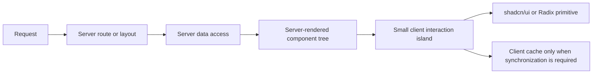

<!-- markdownlint-disable MD013 -->

# Design System and Frontend Architecture

> **Status:** Normative, production-ready specification
>
> **Version:** 1.0 · 2026-07-31
>
> **Single source of truth:** This English document is authoritative. Translations are
> informative and can lag behind it:
> [한국어](./DESIGN.ko.md) · [简体中文](./DESIGN.cn.md) · [日本語](./DESIGN.jp.md)

This specification defines how products built with Next.js, React, Tailwind CSS,
and shadcn/ui should look, behave, and be verified. It borrows Apple's emphasis on
direct manipulation, spatial continuity, restrained materials, and inclusive
defaults, translated into web-native patterns.

The goal is not to copy an Apple interface. The goal is to make the product feel
**calm, direct, and trustworthy**: every action responds immediately, every state
is understandable, and motion preserves the user's sense of control.

The key words **MUST**, **SHOULD**, and **MAY** express requirement strength.

## Contents

1. [Product and design principles](#1-product-and-design-principles)
2. [Stack and architecture](#2-stack-and-architecture)
3. [Design tokens and themes](#3-design-tokens-and-themes)
4. [Typography and iconography](#4-typography-and-iconography)
5. [Layout, responsive behavior, and input](#5-layout-responsive-behavior-and-input)
6. [Component architecture](#6-component-architecture)
7. [Interaction and motion](#7-interaction-and-motion)
8. [Materials, elevation, and layering](#8-materials-elevation-and-layering)
9. [Accessibility, localization, and responsible UX](#9-accessibility-localization-and-responsible-ux)
10. [State, data, and feedback](#10-state-data-and-feedback)
11. [Content and product patterns](#11-content-and-product-patterns)
12. [Engineering and verification](#12-engineering-and-verification)
13. [Setup, completion, and maintenance](#13-setup-completion-and-maintenance)

---

## 1. Product and design principles

### 1.1 Experience target

Every screen and flow MUST reinforce three qualities:

| Quality | The user should feel | Product evidence |
| --- | --- | --- |
| **Calm** | “I can focus on the task.” | One clear primary action, restrained color, no decorative motion, progressive disclosure. |
| **Direct** | “The interface follows me.” | Feedback begins on press, drags track 1:1, animations can be interrupted and reversed. |
| **Trustworthy** | “I know what happened and can recover.” | Explicit status, inline validation, undo for reversible actions, confirmation only for irreversible harm. |

When these qualities conflict, protect trust first, then directness, then visual
calm.

### 1.2 Eight operating principles

| Principle | Required design behavior |
| --- | --- |
| **Purpose** | Every feature, control, and animation MUST have a user outcome. Remove elements that only decorate or duplicate. |
| **Agency** | Users MUST be able to cancel, go back, or undo where the operation permits it. Never lock input merely because an animation is running. |
| **Responsibility** | Ask for the minimum data and permissions, at the moment they are needed. Preview or confirm genuinely destructive, legal, financial, or privacy-sensitive actions. |
| **Familiarity** | Prefer platform and web conventions. Equal-looking controls MUST behave equally; entry and exit paths MUST be spatially consistent. |
| **Flexibility** | Support touch, pointer, keyboard, assistive technology, localization, zoom, and both compact and spacious layouts. |
| **Simplicity** | Put the common path first and advanced controls one level deeper. Simplicity means clarity, not hiding necessary context. |
| **Craft** | Spacing, type, icons, motion, states, and responsive behavior MUST be deliberate and verified in context. |
| **Delight** | Delight SHOULD emerge from speed, clarity, continuity, and small moments of polish; never from confetti or surprise that interrupts work. |

### 1.3 Decision hierarchy

When requirements compete, decide in this order:

1. Safety, privacy, and prevention of irreversible loss.
2. Accessibility and semantic correctness.
3. Task clarity and user control.
4. Performance and perceived responsiveness.
5. Visual refinement and brand expression.

No visual choice may lower a higher-priority outcome.

### 1.4 Wayfinding contract

Every page, overlay, and empty state MUST answer:

- **Where am I?** A page title, selected navigation state, or contextual heading.
- **What is here?** A concise summary, meaningful grouping, and visible state.
- **What can I do?** A clear primary action and discoverable secondary actions.
- **How do I leave?** Browser navigation, visible close/back behavior, and `Escape`
  where the interaction is dismissible.

---

## 2. Stack and architecture

### 2.1 Baseline

New applications use the current stable releases compatible with this baseline:

| Concern | Standard | Ownership rule |
| --- | --- | --- |
| Framework | Next.js App Router | Routes, layouts, server rendering, caching, metadata. |
| UI runtime | React 19 + TypeScript strict mode | Components, composition, and interactive state. |
| Styling | Tailwind CSS 4 + CSS custom properties | CSS-first tokens and responsive/container variants. |
| Components | shadcn/ui source + Radix primitives | Application owns the generated source; primitives supply semantics and interaction behavior. |
| Motion | Motion for React (`motion/react`) | Gesture tracking, springs, layout motion, and reduced-motion integration. |
| Icons | Lucide React | One consistent outline icon family. |
| Forms | React Hook Form + Zod | Form state, accessible validation, and shared schemas. |
| Server state | TanStack Query, only where client synchronization is needed | Client cache, mutation state, invalidation, and optimistic workflows. |
| Client state | URL first; local React state second; Zustand only for shared ephemeral state | Use the narrowest state owner that survives the required scope. |
| Theme | `next-themes` | Light, dark, and system preference without a flash of incorrect theme. |
| Class composition | `clsx`, `tailwind-merge`, CVA | Conditional classes, conflict resolution, and finite variants. |

Dependencies are not architecture. A library MAY be replaced when the replacement
preserves the contracts in this document.

### 2.2 Server and client boundary

Layouts and pages are Server Components by default. Add `"use client"` only at
the smallest boundary that requires state, event handlers, effects, browser APIs,
or a client-only primitive.



Rules:

- Server Components MUST own secrets, privileged data access, and initial data
  loading.
- Props crossing into a Client Component MUST be serializable.
- Providers SHOULD be placed as deep as practical so static regions remain
  server-rendered.
- A Client Component MUST NOT be created only to apply styling.
- Browser-only APIs MUST be read after hydration or behind a client-safe
  abstraction.

### 2.3 Directory boundaries

```text
.
├── app/                         # Routes, layouts, loading/error/not-found boundaries
│   ├── (product)/               # Product route groups
│   ├── globals.css              # Token definitions and global element defaults
│   └── layout.tsx               # Root document and narrowly scoped providers
├── components/
│   ├── ui/                      # Owned primitives; no domain or data-fetching logic
│   ├── common/                  # Cross-feature composition: app shell, search, theme
│   └── features/<feature>/      # Domain-specific view components
├── hooks/                       # Reusable browser and interaction hooks
├── lib/
│   ├── actions/                 # Server actions or mutation adapters
│   ├── queries/                 # Query keys and client query options
│   ├── schemas/                 # Zod schemas shared at trust boundaries
│   └── utils.ts                 # Small, domain-free utilities
├── stores/                      # Shared ephemeral client state only
└── types/                       # Shared public types that do not belong to a feature
```

Feature code SHOULD stay close to the route or feature that owns it. Promote a
component to `common` only after at least two real consumers share the same
semantic behavior, not merely similar appearance.

### 2.4 Rendering and performance budgets

- The initial route MUST render a meaningful server-produced shell.
- Client JavaScript MUST be limited to interactive islands; avoid turning a route
  into one large client boundary.
- Images MUST declare dimensions and use responsive sources.
- Fonts MUST use `next/font` or an equivalent self-hosted, non-blocking strategy.
- Gesture updates MUST animate compositor-friendly `transform` and `opacity`.
- Long lists MUST paginate, virtualize, or progressively reveal before they cause
  interaction latency.
- Loading UI MUST preserve the final layout to avoid cumulative layout shift.

---

## 3. Design tokens and themes

### 3.1 Token model

Components consume **semantic** tokens, never palette values. The indirection is:

```text
primitive value → semantic token → component role → interaction state
```

For example, a component uses `bg-primary`, not `bg-zinc-950`. A destructive
button uses the destructive role, not an arbitrary red.

Token names describe purpose:

- Surface: `background`, `surface`, `surface-raised`, `popover`
- Content: `foreground`, `muted-foreground`
- Action: `primary`, `secondary`, `accent`, `destructive`
- Structure: `border`, `input`, `ring`
- Status: `success`, `warning`, `info`

Hardcoded values are permitted only in token declarations, data visualization
series, or documented one-off media where semantic reuse would be misleading.

### 3.2 Tailwind CSS 4 theme contract

`app/globals.css` defines raw semantic values and exposes them to Tailwind through
`@theme inline`.

```css
@import "tailwindcss";
@import "tw-animate-css";

:root {
  color-scheme: light;

  --background: oklch(0.985 0.002 247.8);
  --foreground: oklch(0.155 0.012 264.4);
  --surface: oklch(1 0 0);
  --surface-raised: oklch(0.995 0.002 247.8);
  --card: oklch(1 0 0);
  --card-foreground: var(--foreground);
  --popover: oklch(0.995 0.002 247.8);
  --popover-foreground: var(--foreground);

  --primary: oklch(0.205 0.014 264.4);
  --primary-foreground: oklch(0.985 0.002 247.8);
  --secondary: oklch(0.955 0.006 264.4);
  --secondary-foreground: oklch(0.25 0.014 264.4);
  --accent: oklch(0.945 0.012 252);
  --accent-foreground: oklch(0.205 0.014 264.4);
  --muted: oklch(0.955 0.006 264.4);
  --muted-foreground: oklch(0.455 0.018 264.4);

  --destructive: oklch(0.57 0.22 27);
  --destructive-foreground: oklch(0.985 0.002 247.8);
  --success: oklch(0.53 0.145 151);
  --success-foreground: oklch(0.985 0.002 247.8);
  --warning: oklch(0.72 0.155 75);
  --warning-foreground: oklch(0.22 0.04 75);
  --info: oklch(0.56 0.17 252);
  --info-foreground: oklch(0.985 0.002 247.8);

  --border: oklch(0.885 0.008 264.4);
  --input: oklch(0.885 0.008 264.4);
  --ring: oklch(0.56 0.16 252);

  --radius: 0.75rem;
  --shadow-color: 220 20% 10%;

  --material-thin: color-mix(in oklab, white 72%, transparent);
  --material-regular: color-mix(in oklab, white 84%, transparent);
  --scrim: oklch(0.08 0.01 264 / 42%);
}

.dark {
  color-scheme: dark;

  --background: oklch(0.13 0.01 264.4);
  --foreground: oklch(0.965 0.004 247.8);
  --surface: oklch(0.175 0.012 264.4);
  --surface-raised: oklch(0.205 0.014 264.4);
  --card: var(--surface);
  --card-foreground: var(--foreground);
  --popover: oklch(0.205 0.014 264.4);
  --popover-foreground: var(--foreground);

  --primary: oklch(0.94 0.006 247.8);
  --primary-foreground: oklch(0.18 0.012 264.4);
  --secondary: oklch(0.255 0.014 264.4);
  --secondary-foreground: oklch(0.95 0.004 247.8);
  --accent: oklch(0.29 0.025 252);
  --accent-foreground: oklch(0.965 0.004 247.8);
  --muted: oklch(0.245 0.012 264.4);
  --muted-foreground: oklch(0.72 0.015 264.4);

  --destructive: oklch(0.64 0.2 27);
  --destructive-foreground: oklch(0.985 0.002 247.8);
  --success: oklch(0.66 0.14 151);
  --success-foreground: oklch(0.13 0.02 151);
  --warning: oklch(0.78 0.14 75);
  --warning-foreground: oklch(0.2 0.04 75);
  --info: oklch(0.69 0.14 252);
  --info-foreground: oklch(0.13 0.02 252);

  --border: oklch(0.31 0.014 264.4);
  --input: oklch(0.31 0.014 264.4);
  --ring: oklch(0.7 0.13 252);

  --material-thin: color-mix(in oklab, black 54%, transparent);
  --material-regular: color-mix(in oklab, black 68%, transparent);
  --scrim: oklch(0.03 0.005 264 / 58%);
}

@theme inline {
  --color-background: var(--background);
  --color-foreground: var(--foreground);
  --color-surface: var(--surface);
  --color-surface-raised: var(--surface-raised);
  --color-card: var(--card);
  --color-card-foreground: var(--card-foreground);
  --color-popover: var(--popover);
  --color-popover-foreground: var(--popover-foreground);
  --color-primary: var(--primary);
  --color-primary-foreground: var(--primary-foreground);
  --color-secondary: var(--secondary);
  --color-secondary-foreground: var(--secondary-foreground);
  --color-accent: var(--accent);
  --color-accent-foreground: var(--accent-foreground);
  --color-muted: var(--muted);
  --color-muted-foreground: var(--muted-foreground);
  --color-destructive: var(--destructive);
  --color-destructive-foreground: var(--destructive-foreground);
  --color-success: var(--success);
  --color-success-foreground: var(--success-foreground);
  --color-warning: var(--warning);
  --color-warning-foreground: var(--warning-foreground);
  --color-info: var(--info);
  --color-info-foreground: var(--info-foreground);
  --color-border: var(--border);
  --color-input: var(--input);
  --color-ring: var(--ring);
  --radius-sm: calc(var(--radius) - 0.25rem);
  --radius-md: calc(var(--radius) - 0.125rem);
  --radius-lg: var(--radius);
  --radius-xl: calc(var(--radius) + 0.25rem);
}
```

The sample values are a neutral starting point, not a substitute for contrast
testing. Brand themes MAY replace values while preserving every semantic role.

### 3.3 Spacing, radius, and density

Use the Tailwind spacing scale with a 4 px base rhythm. Exceptions MUST be named
tokens or explained by an external asset requirement.

| Role | Default | Guidance |
| --- | --- | --- |
| Inline control gap | `0.5rem` | Label-to-icon or sibling controls. |
| Compact component padding | `0.5rem–0.75rem` | Dense toolbars and menus. |
| Standard component padding | `0.75rem–1rem` | Cards, fields, and buttons. |
| Group gap | `1rem–1.5rem` | Related fields or card content. |
| Section gap | `2rem–3rem` | Distinct page regions. |
| Page gutter | `1rem / 1.5rem / 2rem` | Mobile / tablet / desktop. |

Radius communicates containment:

- Small controls use `rounded-md`.
- Cards and floating panels use `rounded-lg` or `rounded-xl`.
- Pills are reserved for tags, compact filters, and binary status—not every
  rectangular control.
- Nested surfaces SHOULD use a smaller radius than their parent.

Density MAY vary by product context, but hit targets, legibility, and focus
appearance MUST not shrink with visual density.

### 3.4 Elevation tokens

Use elevation to explain stacking, not to decorate:

```css
:root {
  --shadow-1:
    0 1px 2px hsl(var(--shadow-color) / 6%),
    0 1px 6px hsl(var(--shadow-color) / 4%);
  --shadow-2:
    0 8px 24px hsl(var(--shadow-color) / 10%),
    0 2px 8px hsl(var(--shadow-color) / 6%);
  --shadow-3:
    0 20px 50px hsl(var(--shadow-color) / 16%),
    0 8px 18px hsl(var(--shadow-color) / 8%);
}
```

- Level 0: content and inset regions.
- Level 1: cards and sticky controls over plain content.
- Level 2: popovers, menus, and non-modal floating panels.
- Level 3: dialogs and sheets over a scrim.

Do not use elevation alone to communicate focus or selection.

---

## 4. Typography and iconography

### 4.1 Type system

The default family is the platform system stack. Custom fonts MUST have a
product reason and a metric-compatible fallback.

```css
html {
  font-family:
    var(--font-sans, ui-sans-serif),
    -apple-system,
    BlinkMacSystemFont,
    "Segoe UI",
    sans-serif;
  font-optical-sizing: auto;
  text-rendering: optimizeLegibility;
}

code,
kbd,
pre,
samp {
  font-family:
    var(--font-mono, ui-monospace),
    "SFMono-Regular",
    Consolas,
    monospace;
}
```

| Role | Size | Line height | Tracking | Weight |
| --- | --- | --- | --- | --- |
| Display | `clamp(2.5rem, 6vw, 4.5rem)` | `1.02` | `-0.035em` | `650–750` |
| Page title | `clamp(2rem, 4vw, 3rem)` | `1.08` | `-0.025em` | `650–750` |
| Section title | `1.5rem` | `1.2` | `-0.015em` | `600–700` |
| Card title | `1rem` | `1.35` | `-0.005em` | `600` |
| Body | `1rem` | `1.55` | `0` | `400` |
| Small | `0.875rem` | `1.45` | `0.005em` | `400–500` |
| Label | `0.8125rem` | `1.35` | `0.01em` | `550–650` |

Tracking and leading MUST change with size. Do not apply one global
`letter-spacing`. Layout spacing SHOULD use `rem` so text scaling and structure
grow together.

Body copy SHOULD remain between 45 and 75 characters per line. Dense application
UI MAY be shorter; long-form reading SHOULD target roughly 65 characters.

### 4.2 Content hierarchy

- Every route MUST have one descriptive `h1`.
- Heading levels MUST not be selected for appearance.
- Emphasis SHOULD come from weight before additional color or size.
- Muted text MUST remain readable and MUST NOT contain essential information that
  disappears in high-contrast or low-quality displays.
- Labels MUST be direct and specific: “Billing history,” not “More”; “Delete
  project,” not “Continue.”
- Numbers in comparison tables SHOULD use tabular figures.

### 4.3 Icons

- Use Lucide icons at a consistent stroke width within one control group.
- Standard icon size is `1rem`; prominent standalone icons MAY use `1.25rem`.
- Icon-only controls MUST have an accessible name and a tooltip when the action is
  not universally understood.
- Icons MUST not be the only carrier of status, error, or destructive meaning.
- Do not mix filled, outlined, and multicolor icon families in the same product
  surface.
- Decorative icons use `aria-hidden="true"`.

---

## 5. Layout, responsive behavior, and input

### 5.1 Layout primitives

Pages use four composable primitives:

1. **App shell** — global navigation and utility actions.
2. **Page container** — centered readable width and responsive gutter.
3. **Section** — semantic grouping with a title and optional action.
4. **Cluster or grid** — local arrangement driven by content constraints.

```tsx
export function PageContainer({ className, ...props }: React.ComponentProps<"div">) {
  return (
    <div
      className={cn(
        "mx-auto w-full max-w-[90rem] px-4 sm:px-6 lg:px-8",
        className,
      )}
      {...props}
    />
  );
}
```

Use CSS Grid for two-dimensional page structure and Flexbox for one-dimensional
alignment. Prefer `gap` over sibling margins.

### 5.2 Breakpoints and container queries

Breakpoints represent layout pressure, not device names:

| Breakpoint | Width | Typical change |
| --- | --- | --- |
| Base | `< 40rem` | One column, bottom or sheet navigation, concise actions. |
| `sm` | `≥ 40rem` | Two-column fields where labels remain readable. |
| `md` | `≥ 48rem` | Persistent secondary navigation, denser toolbars. |
| `lg` | `≥ 64rem` | Multi-column content and expanded data views. |
| `xl` | `≥ 80rem` | Wider workspace without stretching reading measure. |
| `2xl` | `≥ 96rem` | Additional context panels, not oversized core content. |

Reusable components SHOULD respond to their container rather than the viewport:

```tsx
<section className="@container">
  <div className="grid gap-4 @md:grid-cols-2 @xl:grid-cols-3">
    {children}
  </div>
</section>
```

Responsive adaptation is not just stacking. It MAY change:

- Navigation presentation: sidebar → sheet or bottom navigation.
- Action density: labeled toolbar → prioritized actions plus overflow menu.
- Data presentation: table → cards or horizontally scrollable region with an
  explicit affordance.
- Overlay presentation: popover → bottom sheet.

The semantic order and accessible names MUST remain consistent.

### 5.3 App shell

```tsx
export default function ProductLayout({ children }: { children: React.ReactNode }) {
  return (
    <SidebarProvider>
      <div className="min-h-dvh bg-background text-foreground">
        <AppSidebar />
        <div className="lg:pl-[var(--sidebar-width)]">
          <header className="material-bar sticky top-0 z-40">
            <PageContainer className="flex min-h-14 items-center gap-3">
              <SidebarTrigger className="lg:hidden" />
              <Breadcrumbs className="min-w-0 flex-1" />
              <GlobalActions />
            </PageContainer>
          </header>
          <main id="main-content" tabIndex={-1}>
            <PageContainer className="py-6 sm:py-8">{children}</PageContainer>
          </main>
        </div>
      </div>
    </SidebarProvider>
  );
}
```

The app shell MUST include a skip link, a programmatically focusable main region,
and a visible mobile navigation trigger. Sticky chrome MUST not obscure focused
elements.

### 5.4 Input modes and targets

- All functionality MUST work with keyboard and a single pointer.
- Touch targets MUST be at least 24 × 24 CSS px under WCAG 2.2 AA; the product
  default is 44 × 44 CSS px for primary touch controls.
- Visually compact controls MAY use transparent hit padding to retain a 44 px
  interactive area.
- Pointer hover is enhancement only. Never hide required actions exclusively
  behind hover.
- Drag interactions MUST have a click, keyboard, or menu alternative.
- Respect safe-area insets for full-height mobile surfaces:
  `padding-bottom: env(safe-area-inset-bottom)`.
- Use `100dvh` for viewport-filling application frames; avoid trapping document
  scroll without a modal reason.

### 5.5 Overflow and reflow

- No page-level horizontal overflow from 320 CSS px upward.
- At 400% zoom, core tasks MUST reflow without loss of content or functionality.
- Text truncation MUST expose the full value through expansion, a detail view, or
  an accessible tooltip—not `title` alone.
- Tables MUST identify row and column headers. When horizontal scrolling is
  necessary, the scroll region MUST be keyboard-focusable and visibly labeled.
- Fixed heights are prohibited for text-bearing containers unless overflow is
  explicitly managed.

---

## 6. Component architecture

### 6.1 Ownership layers

| Layer | Responsibility | Must not contain |
| --- | --- | --- |
| Primitive (`components/ui`) | Semantics, states, focus, finite visual variants. | Product copy, data fetching, route assumptions. |
| Pattern (`components/common`) | Reusable compositions such as search, page header, data state. | Feature-specific business rules. |
| Feature (`components/features`) | Domain language, permissions, mutations, analytics. | Duplicated primitive behavior. |
| Route (`app`) | Data loading, layout composition, route boundaries, metadata. | Reimplemented component internals. |

Copy generated shadcn/ui code into the repository, review it, and treat it as
owned source. Upgrades are source migrations, not blind package bumps.

### 6.2 Primitive contract

Every interactive primitive MUST define:

- Semantic element, role, accessible name, and relationships.
- Default, hover, active, focus-visible, disabled, loading, and error states as
  applicable.
- Pointer, keyboard, and touch behavior.
- Light, dark, increased-contrast, and reduced-motion behavior.
- Size and variant boundaries.
- Content limits and overflow behavior.
- Controlled and uncontrolled APIs where both are genuinely needed.

Disabled controls MUST expose why when the reason is not obvious. Loading controls
MUST retain their width and accessible name, set `aria-busy` where appropriate,
and prevent duplicate submission.

### 6.3 Class composition and variants

```ts
// lib/utils.ts
import { clsx, type ClassValue } from "clsx";
import { twMerge } from "tailwind-merge";

export function cn(...inputs: ClassValue[]) {
  return twMerge(clsx(inputs));
}
```

Use CVA for a small, finite set of semantic variants:

```tsx
import { Slot } from "@radix-ui/react-slot";
import { cva, type VariantProps } from "class-variance-authority";

const buttonVariants = cva(
  [
    "inline-flex min-h-11 items-center justify-center gap-2 rounded-md px-4",
    "text-sm font-semibold transition-[color,background-color,box-shadow,transform]",
    "focus-visible:outline-none focus-visible:ring-2 focus-visible:ring-ring",
    "focus-visible:ring-offset-2 focus-visible:ring-offset-background",
    "disabled:pointer-events-none disabled:opacity-50",
    "active:scale-[0.98] motion-reduce:transform-none",
    "[&_svg]:size-4 [&_svg]:shrink-0",
  ],
  {
    variants: {
      variant: {
        primary: "bg-primary text-primary-foreground shadow-[var(--shadow-1)]",
        secondary: "bg-secondary text-secondary-foreground",
        outline: "border border-border bg-background text-foreground",
        ghost: "text-foreground hover:bg-accent",
        destructive: "bg-destructive text-destructive-foreground",
      },
      size: {
        default: "min-h-11 px-4",
        compact: "min-h-9 px-3",
        icon: "size-11 px-0",
      },
    },
    defaultVariants: { variant: "primary", size: "default" },
  },
);

type ButtonProps = React.ComponentProps<"button"> &
  VariantProps<typeof buttonVariants> & {
    asChild?: boolean;
  };

export function Button({
  asChild = false,
  className,
  variant,
  size,
  ...props
}: ButtonProps) {
  const Component = asChild ? Slot : "button";

  return (
    <Component
      data-slot="button"
      className={cn(buttonVariants({ variant, size }), className)}
      {...props}
    />
  );
}
```

React 19 function components accept `ref` as a prop, so new primitives SHOULD
follow the current shadcn/ui pattern instead of wrapping everything in
`React.forwardRef`.

`asChild` MAY remove redundant wrappers, but the child MUST remain one valid,
semantic interactive element. Never nest a button inside a button or an anchor
inside an anchor.

### 6.4 Component catalog and selection

| Need | Preferred primitive or pattern |
| --- | --- |
| Commit an immediate action | `Button` |
| Navigate to a resource | `Link`, optionally styled with `Button asChild` |
| Choose one value from a short visible set | `RadioGroup` |
| Choose one value from a long set | `Select` or searchable `Combobox` |
| Toggle an immediately applied setting | `Switch` |
| Include or exclude a value in a submission | `Checkbox` |
| Reveal supporting content in place | `Accordion` or `Collapsible` |
| Short contextual actions | `DropdownMenu` |
| Additional context without blocking work | `Popover` |
| Focused, reversible task | `Dialog` |
| Mobile or edge-attached focused task | `Sheet` or drawer |
| Confirm irreversible harm | `AlertDialog` |
| Brief non-blocking completion feedback | Sonner toast |
| Persistent warning or error | Inline `Alert` near the affected content |
| Loading structure | Shape-matched `Skeleton` |
| No data | Purpose-built empty state with a next action |

Do not use a dialog for information that belongs in the page, a tooltip for
required instructions, or a toast as the only record of an error.

### 6.5 Overlay contract

- Opening an overlay MUST move focus to the first meaningful control or the
  container when reading context comes first.
- Modal overlays MUST trap focus, mark the background inert, and restore focus to
  the trigger on close.
- `Escape` closes dismissible overlays. Destructive progress that cannot be
  canceled MUST explain why dismissal is unavailable.
- Entry and exit MUST follow the same spatial path and originate from the trigger
  or attached edge.
- Popovers and menus align to their trigger and avoid viewport clipping.
- A mobile sheet MUST expose a visible close control even when a swipe-to-dismiss
  gesture exists.

---

## 7. Interaction and motion

### 7.1 Motion principles

Motion is behavior, not decoration. It exists to:

1. Confirm input.
2. Preserve spatial context.
3. Explain state change.
4. Carry direct manipulation into a natural resting state.

An interaction is fluid only when it starts from the current on-screen value,
inherits input velocity, and can be interrupted at any time.

### 7.2 Response and direct manipulation

- Press feedback MUST begin on `pointerdown`, `keydown`, or the equivalent
  primitive state—not after `click`.
- Tap actions commit on release, allowing pointer cancellation by moving away.
- Dragged content MUST track the pointer 1:1 and preserve the offset where the
  user grabbed it.
- Pointer-driven custom controls MUST use Pointer Events and
  `setPointerCapture()`.
- Directional gestures SHOULD wait for roughly 8–10 px of movement before locking
  an axis, while still rendering immediate press feedback.
- Gesture recognizers MUST observe plausible gestures together, then resolve once
  intent is clear. Do not depend on a final-only “swipe” event.

### 7.3 Interruptibility

Gesture-driven animations MUST be interruptible:

- Never block pointer or keyboard input until an animation finishes.
- A new gesture starts from the presentation value currently on screen, not the
  previous target.
- Retargeting carries current velocity into the new spring.
- X and Y motion use independent values when their velocities differ.
- CSS transitions and keyframes are appropriate for simple state feedback, but
  not for motion a user can grab and redirect.

If a closing sheet is grabbed again, it follows the pointer immediately from its
visible location. It does not finish closing first.

### 7.4 Spring language

Reason about springs with **damping ratio** and **response**, not a pretend fixed
duration:

| Interaction | Damping ratio | Response | Character |
| --- | --- | --- | --- |
| Default reposition | `1.0` | `0.4 s` | Critically damped, no overshoot. |
| Menu or popover materialization | `1.0` | `0.3 s` | Fast and restrained. |
| Momentum-driven sheet snap | `0.8` | `0.3 s` | Slight overshoot earned by the gesture. |
| Momentum-driven rotation | `0.8` | `0.4 s` | Physical but controlled. |

Bounce is reserved for motion with real gesture momentum. A menu that appears
after a click does not bounce.

Motion for React can express the house style:

```tsx
"use client";

import { MotionConfig, motion, useReducedMotion } from "motion/react";

export function MotionProvider({ children }: { children: React.ReactNode }) {
  return (
    <MotionConfig
      reducedMotion="user"
      transition={{ type: "spring", bounce: 0, duration: 0.4 }}
    >
      {children}
    </MotionConfig>
  );
}

export function PressableCard(props: React.ComponentProps<typeof motion.button>) {
  const reduceMotion = useReducedMotion();

  return (
    <motion.button
      whileTap={reduceMotion ? undefined : { scale: 0.98 }}
      transition={{ type: "spring", bounce: 0, duration: 0.2 }}
      {...props}
    />
  );
}
```

### 7.5 Velocity handoff and projection

At release, the resting state is chosen from where the gesture is **going**, not
only where it stopped:

```ts
export function project(
  velocity: number,
  decelerationRate = 0.998,
): number {
  return (velocity / 1000) * (decelerationRate / (1 - decelerationRate));
}

const projectedPosition = currentPosition + project(releaseVelocity);
const target = nearestSnapPoint(projectedPosition);

// Pass releaseVelocity into the spring that animates from currentPosition to target.
```

If an animation API expects relative velocity:

```text
relative velocity = gesture velocity / (target - current position)
```

Guard a zero remaining distance. Prefer APIs, including Motion, that accept the
absolute velocity directly.

### 7.6 Soft boundaries

Dragging past a boundary SHOULD remain continuous with progressive resistance:

```ts
export function rubberBand(
  overshoot: number,
  dimension: number,
  constant = 0.55,
): number {
  return (
    (overshoot * dimension * constant) /
    (dimension + constant * Math.abs(overshoot))
  );
}
```

A hard stop feels frozen. Rubber-banding communicates “there is nothing beyond
this edge” while preserving response.

### 7.7 Spatial continuity

- Enter and exit along the same path.
- Menus and popovers materialize from their trigger; sheets attach to their edge.
- Shared elements preserve perceived identity through a transition.
- Background content MAY scale or move subtly behind a modal, but MUST not
  compete with the foreground task.
- Reversible transitions use symmetric paths and compatible easing.
- Large motion SHOULD fade or lower contrast during travel, then restore it at
  rest.

### 7.8 Performance contract

- Continuous motion uses `transform` and `opacity`.
- Read layout before the animation loop; do not alternate layout reads and writes
  every frame.
- Use `requestAnimationFrame` for custom frame work.
- Apply `will-change` only shortly before motion and remove it after settling.
- Avoid animating expensive blur over large, busy regions. If material blur is
  necessary, keep the surface bounded and test lower-powered devices.
- Test fast motion frame-by-frame for jumps at grab, release, reversal, and snap.

### 7.9 Reduced motion

Reduced motion preserves feedback while removing vestibular movement:

```css
@media (prefers-reduced-motion: reduce) {
  *,
  *::before,
  *::after {
    scroll-behavior: auto !important;
  }

  [data-motion="spatial"] {
    animation: none !important;
    transform: none !important;
    transition: opacity 160ms ease-out !important;
  }
}
```

- Replace slides, springs, parallax, zooms, and elastic motion with a short
  cross-fade or immediate state change.
- Preserve status, focus, progress, and completion feedback.
- Do not run full-viewport moving backgrounds or sustained oscillation.
- Never make essential information depend on animation.

---

## 8. Materials, elevation, and layering

### 8.1 Functional layer versus content layer

Translucent material is reserved for the **functional layer**—navigation,
toolbars, transient controls, and overlays floating over content. Cards and core
content use solid or near-solid surfaces.

This distinction keeps hierarchy legible:

```text
modal task
  └── scrim
      └── floating functional layer
          └── content layer
              └── application background
```

Do not cover every card in glass. Do not stack translucent surfaces. A nested
light material loses contrast and makes depth ambiguous.

### 8.2 Material implementation

```css
.material-bar {
  background: var(--material-regular);
  border-bottom: 1px solid color-mix(in oklab, var(--border) 70%, transparent);
  box-shadow: var(--shadow-1);
  -webkit-backdrop-filter: blur(20px) saturate(160%);
  backdrop-filter: blur(20px) saturate(160%);
}

@supports not (backdrop-filter: blur(1px)) {
  .material-bar {
    background: var(--surface);
  }
}

@media (prefers-reduced-transparency: reduce) {
  .material-bar {
    background: var(--surface);
    -webkit-backdrop-filter: none;
    backdrop-filter: none;
  }
}

@media (prefers-contrast: more) {
  .material-bar {
    background: var(--background);
    border-color: var(--foreground);
  }
}
```

Because `prefers-reduced-transparency` support is not universal, every material
MUST remain readable when `backdrop-filter` is unavailable.

### 8.3 Layering rules

- Sticky navigation uses material without a scrim so content flow remains
  visible.
- Modal dialogs and sheets use a scrim because they suspend the background task.
- Non-modal inspectors use separation, offset, and elevation without a scrim.
- Larger surfaces use stronger separation than small controls.
- Text over material uses semantic foreground colors, sufficient weight, and
  verified contrast—not arbitrary gray.
- Color belongs primarily to solid content and action surfaces; translucent
  foregrounds stay neutral enough to preserve legibility.
- Avoid hard dividers below floating chrome when a subtle scroll-edge gradient
  communicates overlap more naturally.

### 8.4 Material motion

Material surfaces SHOULD materialize rather than merely fade:

- A popover scales subtly from its trigger while opacity and blur settle together.
- A sheet moves from and returns to its attached edge.
- A dialog appears from its current visual origin without a large zoom.
- Reduced motion replaces materialization with a short cross-fade.

The surface MUST remain interruptible throughout entry and exit.

---

## 9. Accessibility, localization, and responsible UX

### 9.1 Conformance target

Products MUST meet WCAG 2.2 Level AA. Compliance is the floor; familiar,
comfortable operation across input modes is the product standard.

| Requirement | Acceptance evidence |
| --- | --- |
| Semantic structure | Landmarks, headings, lists, tables, buttons, and links match their meaning in the accessibility tree. |
| Keyboard access | Every task can be completed without a pointer; focus order follows the visual and semantic order. |
| Focus visibility | Focus is never removed, clipped, hidden by sticky UI, or represented by color alone. |
| Text contrast | Normal text is at least 4.5:1; large text is at least 3:1. |
| Non-text contrast | Control boundaries, states, and focus indicators reach at least 3:1 against adjacent colors. |
| Text resizing | Content remains usable at 200% text size and core tasks reflow at 400% browser zoom. |
| Pointer access | Targets meet WCAG minimum sizing and primary touch controls target 44 × 44 CSS px. |
| Gesture alternatives | Dragging, swiping, path gestures, and device motion have a single-pointer or control-based alternative. |
| Status announcements | Async success, errors, and progress are exposed programmatically without moving focus unnecessarily. |
| Time and motion | Time limits are adjustable where possible; motion and auto-updating content can be paused or reduced. |

Automated checks help find omissions but do not prove conformance. Keyboard,
screen reader, zoom, contrast, motion, and real-device checks are required.

### 9.2 Keyboard and focus

- Use native interactive elements before ARIA roles.
- `Tab` moves between controls; arrow keys operate composite widgets according to
  their established pattern.
- `Enter` activates links and buttons; `Space` activates buttons and toggles
  without scrolling the page.
- `Escape` dismisses the topmost dismissible layer.
- Focus MUST return to the logical trigger after a dialog, menu, or popover
  closes.
- Route changes MUST place focus at the new page heading or main content when
  browser-native focus behavior does not communicate the change.
- Roving `tabindex` is reserved for composite widgets such as tabs, toolbars,
  menus, and grids.
- Positive `tabindex` values are prohibited.

Use `:focus-visible` for the visual indicator, but never remove the browser
outline without a replacement that remains visible in every theme.

```css
:where(a, button, input, select, textarea, [tabindex="0"]):focus-visible {
  outline: 2px solid var(--ring);
  outline-offset: 3px;
}
```

### 9.3 Accessible names and status

- Icon-only controls use `aria-label` or visible text exposed through `sr-only`.
- The accessible name MUST contain the visible label.
- Use `aria-describedby` for persistent help and error relationships.
- Use `aria-invalid="true"` only after a value has been evaluated and found
  invalid.
- Use `aria-live="polite"` for non-urgent status and `role="alert"` sparingly for
  urgent errors.
- A busy region SHOULD expose `aria-busy="true"` while retaining its heading and
  recognizable structure.
- Do not move focus to a toast.

ARIA does not repair incorrect semantics. A styled `<div>` is not a button.

### 9.4 Visual and cognitive accessibility

- Never communicate state through color alone; pair it with text, shape, or an
  icon and accessible name.
- Respect `prefers-reduced-motion`, `prefers-contrast`, and, when supported,
  `prefers-reduced-transparency`.
- Keep instructions adjacent to the control they describe.
- Use plain, specific language and consistent control placement.
- Avoid flashing content, unexpected autoplay, and countdown pressure.
- Preserve user-entered values after validation or recoverable network errors.
- Long tasks MUST expose progress or an honest indeterminate state.
- Error messages state what happened, what remains safe, and what the user can do
  next.

### 9.5 Forms and authentication

- Every field has a persistent visible label; placeholders are examples, not
  labels.
- Required fields are identified in text before input begins.
- Validate locally when useful, and validate again at the trust boundary.
- Show field errors beside the field and a summary at the top when multiple
  errors block submission.
- Focus the summary after a failed submit, with links to invalid fields.
- Do not disable the submit button merely because a form is incomplete; allow
  submission to reveal actionable validation unless a live constraint is
  explicit and understandable.
- Password managers and paste MUST work.
- Authentication MUST NOT rely only on memory, transcription, or puzzle solving
  when an accessible alternative can be provided.

### 9.6 Localization and bidirectionality

- All user-facing strings live outside component logic and support parameterized
  messages.
- Never concatenate translated sentence fragments.
- Layouts MUST tolerate at least 30% text expansion and multi-line controls.
- Dates, times, numbers, currencies, plural rules, and relative time use
  locale-aware formatters.
- Store timestamps in an unambiguous format and display the user's timezone.
- Use logical properties and utilities (`margin-inline`, `start`, `end`) so RTL
  does not require a parallel stylesheet.
- Directional icons mirror only when their meaning is spatial. Media controls,
  brand marks, clocks, and universal symbols do not mirror.
- CJK copy MAY need additional line height and language-appropriate line breaking.
- The document language and language changes MUST be declared.

### 9.7 Privacy, safety, and irreversible actions

- Request the least permission needed and explain its purpose before the browser
  or operating system prompt.
- Sensitive values MUST not appear in URLs, analytics, logs, or toast messages.
- Destructive actions use specific copy: “Delete workspace,” not “Yes.”
- Prefer immediate action plus undo for cheap, reversible changes.
- Use confirmation for irreversible deletion, financial or legal commitment,
  broad permission changes, or an action whose impact is difficult to preview.
- Confirmation MUST name the object and consequence. High-risk confirmation MAY
  require re-entry of a meaningful identifier.
- Long-running destructive work MUST not claim success before the server confirms
  completion.
- AI-generated or uncertain output MUST be labeled when users could mistake it
  for verified fact, and high-impact output needs an appropriate review step.

---

## 10. State, data, and feedback

### 10.1 State ownership

Choose the narrowest owner that matches the state's lifetime:

| State | Owner | Examples |
| --- | --- | --- |
| Shareable navigation state | URL path and search params | Selected tab, filters, page, search query. |
| Server-authoritative state | Server Component, server action, or API | User, project, permissions, persisted settings. |
| Client server cache | TanStack Query when live client synchronization is needed | Infinite list, background refresh, optimistic mutation. |
| Local interaction state | Component state or reducer | Open state, draft selection, temporary drag position. |
| Shared ephemeral state | Context or Zustand after a real cross-tree need exists | Command palette, workspace inspector, temporary selection model. |
| Form state | React Hook Form | Dirty fields, validation, submission state. |
| Theme preference | `next-themes` plus system preference | Light, dark, system. |

Do not duplicate the same source of truth across URL, store, and component state.
Derive values during render when they can be computed from authoritative state.

### 10.2 Async state model

Every data surface defines these states:

```text
idle → pending → success
             ↘ empty
             ↘ recoverable error → retrying
             ↘ terminal error

success → refreshing
success → stale/offline
```

The rendered state MUST distinguish:

- **Initial pending:** no usable data exists yet.
- **Refreshing:** usable data remains visible while a newer result is fetched.
- **Empty:** the request succeeded and returned no content.
- **Error:** the request failed; show scope, safe retained data, and a recovery
  action.
- **Offline or stale:** identify data freshness without erasing usable content.

Never show an empty state for an error or a skeleton for an indefinite operation.

### 10.3 Loading

- Prefer server-rendered content and route-level streaming.
- Skeletons match the final geometry and appear only when the shape is predictable.
- Use a spinner for a compact indeterminate action, not an entire page.
- After roughly one second, long operations SHOULD explain what is happening.
- Determinate work exposes progress, and cancellable work exposes cancel.
- Preserve prior data during background refresh and mark it as updating.
- Loading controls retain their label or an equivalent accessible name.

### 10.4 Empty and zero states

An empty state explains:

1. What belongs here.
2. Why it is empty, when known.
3. The most useful next action.

Differentiate a first-use empty state, no search results, cleared filters, and a
permission-limited state. “No results” SHOULD offer query correction or filter
reset; it MUST NOT imply that no data exists globally.

### 10.5 Errors and recovery

Place errors at the scope where they can be acted on:

- Field errors beside fields.
- Section errors inside the failed section.
- Route errors inside a route error boundary.
- Global alerts only for cross-application failure.

Error copy follows this structure:

```text
Outcome: “We couldn't save the profile.”
Safety:  “Your changes are still here.”
Action:  “Check your connection and try again.”
```

Retry MUST be safe. If the operation may already have committed, reconcile with
the server before repeating it.

### 10.6 Mutations, optimistic UI, and undo

- Optimistic updates are appropriate only when success is likely, rollback is
  deterministic, and the UI clearly distinguishes pending state.
- Disable duplicate submission while one mutation is in flight.
- Use idempotency keys for operations that can be retried after an uncertain
  response.
- On failure, restore the previous state and keep the user's input.
- A toast undo MUST remain available long enough to use and MUST have a persistent
  alternative for consequential changes.
- Do not use optimism for irreversible deletion, money movement, or a state whose
  rollback cannot be guaranteed.

### 10.7 Feedback taxonomy

| Kind | Meaning | Presentation |
| --- | --- | --- |
| **Status** | Work is ongoing or state changed. | Inline text, progress, badge, or polite live region. |
| **Completion** | A meaningful operation succeeded. | Updated content first; toast only when the result is otherwise out of view. |
| **Warning** | The action is possible but carries a consequence. | Inline callout near the decision, before commitment. |
| **Error** | Work failed or input is invalid. | Persistent message at the actionable scope with recovery. |

Feedback begins at the causal event. Visual, sound, and haptic feedback—when the
platform supports it and the product truly benefits—MUST align in time and remain
optional. Reserve multimodal feedback for meaningful commit, success, and error
moments.

---

## 11. Content and product patterns

### 11.1 Page hierarchy

The first viewport SHOULD make the page's purpose, current state, and primary
action obvious.

- Use one primary action per task region.
- Secondary actions are visually quieter; infrequent actions move into an
  overflow menu.
- Destructive actions do not sit adjacent to the primary action without clear
  separation.
- Group controls next to the content they affect.
- Progressive disclosure reveals advanced settings without hiding the common
  path.
- Preserve a stable location for repeated actions across related screens.

### 11.2 Voice and labels

Product copy is concise, specific, and calm:

- Use sentence case.
- Start action labels with a concrete verb: “Create report,” “Save changes.”
- Name navigation by destination: “Projects,” “Billing,” “Activity.”
- Avoid “OK,” “Yes,” “No,” “Submit,” and “Continue” when the real outcome can be
  named.
- Avoid blame. Say “Enter a valid email address,” not “You entered an invalid
  email.”
- Do not claim “Done” until the authoritative operation has completed.

### 11.3 Search and filters

- Search fields use a visible or programmatic label and describe their scope.
- Submit server-backed searches after a short, cancelable debounce or explicit
  submission according to cost and user expectation.
- The query and durable filters live in the URL.
- Active filters are visible, individually removable, and resettable together.
- Results communicate count or scope when useful.
- Empty results preserve the query and provide a path to broaden it.
- Keyboard focus stays in the search flow; result updates use a polite live
  region without announcing every keystroke.

### 11.4 Navigation and command interfaces

- Global navigation contains stable destinations, not contextual actions.
- Breadcrumbs communicate hierarchy and are supplementary to, not a replacement
  for, a page title.
- Tabs switch peer views inside one context; they do not imitate unrelated
  navigation.
- A command palette supplements visible navigation. It MUST not become the only
  path to an action.
- Keyboard shortcuts MUST be discoverable, remappable where collision is likely,
  and disabled while typing unless they include a modifier.
- Platform conventions take precedence: show `⌘` on macOS and `Ctrl` elsewhere
  when the shortcut differs.

### 11.5 Tables and dense data

- Tables are for comparison across consistent columns, not general layout.
- Headers remain associated with cells, including sorted state.
- Row actions are keyboard-reachable and have names that include row context.
- Bulk selection shows selected count and scopes “Select all” precisely.
- Pagination preserves filters, sorting, and return position.
- On narrow screens, hide only low-priority columns or switch to labeled cards;
  do not remove essential data.
- Numeric data aligns by decimal or end edge and uses tabular figures.

### 11.6 Charts

- Every chart has a title, a text summary, units, and an accessible data
  alternative.
- Color series maintain contrast and use shape, line style, direct labels, or
  symbols as a second channel.
- Do not encode unrelated series as misleading stacked areas or probability
  bands.
- Tooltips are keyboard and touch accessible; essential values remain available
  without hover.
- Axes start, scale, and truncation MUST not distort the intended comparison.
- Motion MAY explain a data transition but MUST not be required to read it.

### 11.7 Notifications

- Use a toast for brief, non-blocking confirmation that is otherwise out of view.
- Use inline status for validation, persistent errors, and information needed to
  continue.
- Toasts MUST pause on hover and focus, remain keyboard operable, and avoid
  covering primary controls.
- Multiple toasts queue or consolidate; they do not form an unreadable stack.
- Notification history is required when loss of the message would matter.

---

## 12. Engineering and verification

### 12.1 TypeScript and naming

- TypeScript uses `strict: true`.
- External data enters as `unknown` and is narrowed or parsed at the boundary.
- Avoid `any`; a necessary escape hatch MUST be local, documented, and covered by
  a boundary test.
- Files use `kebab-case`; React components use `PascalCase`; hooks begin with
  `use`; booleans read as states such as `isOpen` or `hasAccess`.
- Event handlers describe the outcome: `handleSave`, not `handleClick`.
- Prefer named exports for reusable components.
- Import through the closest stable boundary; do not reach through another
  feature's internals.

### 12.2 Component delivery contract

A new or materially changed component is complete only with:

- Semantic markup and accessible name/description relationships.
- Keyboard, pointer, touch, and focus behavior.
- Default, hover, active, focus-visible, disabled, loading, empty, and error states
  that apply.
- Light, dark, reduced-motion, increased-contrast, and transparency-fallback
  behavior.
- Responsive and long-content behavior.
- Focused unit or component tests for logic and interaction.
- A browser-verifiable example or story for meaningful visual states.
- Documentation of non-obvious constraints and destructive consequences.

### 12.3 Test strategy

| Layer | Proves | Typical tools |
| --- | --- | --- |
| Static | Types, lint, forbidden patterns, build graph. | TypeScript, ESLint, framework build. |
| Unit | Pure functions, schema rules, projection and state reducers. | Vitest or Jest. |
| Component | Semantics, variants, focus, keyboard, validation, state rendering. | Testing Library and user-event. |
| Accessibility automation | Common name, role, relationship, and contrast issues. | axe-core or equivalent. |
| Browser flow | Routing, persistence, overlays, responsive tasks, real network behavior. | Playwright. |
| Visual | Theme, density, clipping, typography, motion endpoints. | Story snapshots plus human review. |
| Device and assistive tech | Input feel, viewport behavior, screen reader output. | Real devices and platform assistive technology. |

Tests SHOULD query by role and accessible name. Avoid selectors tied only to class
names or internal component structure.

### 12.4 Required browser and device matrix

Before release, verify:

- Current and previous major Chrome and Safari.
- Current Firefox and Edge.
- iOS Safari on a physical phone.
- Android Chrome on a physical phone.
- Keyboard-only use on desktop.
- VoiceOver on macOS or iOS.
- At least one additional screen reader/browser combination appropriate to the
  audience.
- Light, dark, increased contrast, and reduced motion.
- 320 CSS px width, common tablet width, standard desktop, and a wide workspace.
- 200% text size and 400% browser zoom for core flows.

Emulation is useful during development but does not replace physical touch,
viewport, keyboard, audio/haptic, or assistive-technology evidence.

### 12.5 Interaction review

For every gesture or spatial animation, record or inspect:

1. Initial press feedback.
2. Threshold crossing and direction lock.
3. 1:1 tracking and preserved grab offset.
4. Release with slow and fast velocities in both directions.
5. Projected target selection.
6. Interruption during entry, travel, settling, and exit.
7. Boundary resistance.
8. Reduced-motion equivalent.
9. Keyboard and single-pointer alternative.
10. Frame pacing on a representative lower-powered device.

A video at normal speed proves overall feel; slow-motion or frame stepping proves
continuity at the seams.

### 12.6 Pull request evidence

User-facing pull requests SHOULD include:

- What outcome changed and why.
- Screenshots for light, dark, mobile, and desktop states.
- A short recording for meaningful interaction or motion.
- Keyboard and accessibility evidence.
- Commands run and their results.
- Known limitations, follow-up work, or intentionally unsupported states.

Generated snapshots are evidence only when their covered state is named.

---

## 13. Setup, completion, and maintenance

### 13.1 Project setup

The examples use pnpm; an equivalent package manager MAY be selected once per
repository.

```bash
pnpm create next-app@latest my-app \
  --ts \
  --tailwind \
  --eslint \
  --app \
  --import-alias "@/*"

cd my-app
pnpm dlx shadcn@latest init
pnpm dlx shadcn@latest add \
  accordion alert alert-dialog avatar badge breadcrumb button card checkbox \
  command dialog dropdown-menu form input label popover radio-group select \
  separator sheet sidebar skeleton slider sonner switch table tabs textarea \
  tooltip

pnpm add \
  motion lucide-react next-themes zod react-hook-form @hookform/resolvers \
  class-variance-authority clsx tailwind-merge
```

Add TanStack Query or Zustand only when the state ownership matrix demonstrates a
need:

```bash
pnpm add @tanstack/react-query
pnpm add zustand
```

Review every generated component and commit local modifications before running an
overwrite or upgrade command.

### 13.2 Required project scripts

Each consuming application MUST expose equivalent commands:

```bash
pnpm lint
pnpm typecheck
pnpm test
pnpm test:e2e
pnpm build
```

The exact tools MAY vary, but local and CI commands MUST be the same. CI MUST fail
on type, lint, test, accessibility gate, or production build failure.

### 13.3 Definition of ready

Implementation starts when:

- [ ] The user outcome and primary task are named.
- [ ] Content hierarchy and route ownership are known.
- [ ] Loading, empty, success, error, offline, and permission states are defined.
- [ ] Destructive, financial, legal, privacy, and AI-related risks are identified.
- [ ] Keyboard, touch, responsive, localization, and reduced-motion behavior are
      described.
- [ ] The authoritative data source and mutation reconciliation strategy are known.
- [ ] Acceptance evidence can be produced in the relevant browser or device.

### 13.4 Definition of done

The work is complete only when:

- [ ] The common path is obvious and advanced controls are progressively disclosed.
- [ ] Semantic tokens replace hardcoded reusable colors, spacing, and motion.
- [ ] Light and dark themes meet contrast requirements.
- [ ] Keyboard order, focus visibility, focus restoration, and `Escape` behavior
      are correct.
- [ ] Screen reader names, roles, values, relationships, and status announcements
      are verified.
- [ ] Touch targets, drag alternatives, and pointer cancellation are verified.
- [ ] Motion starts immediately, tracks continuously, hands off velocity, remains
      interruptible, and has a reduced-motion equivalent.
- [ ] Materials have solid fallbacks and remain legible with reduced transparency
      or increased contrast.
- [ ] No page-level horizontal overflow occurs from 320 CSS px upward.
- [ ] Long localized content, 200% text, and 400% zoom preserve core tasks.
- [ ] Loading, empty, error, stale, offline, optimistic, and rollback states behave
      as specified.
- [ ] Destructive actions expose their object, impact, and recovery or confirmation.
- [ ] Static, unit, component, browser, accessibility, and production-build gates
      pass for the affected scope.
- [ ] Physical-device and assistive-technology evidence covers the changed
      interaction.
- [ ] Documentation, screenshots, and recordings match the delivered behavior.

A checked box is a claim backed by named evidence, not a substitute for it.

### 13.5 Maintenance

Review this specification when:

- A major React, Next.js, Tailwind CSS, shadcn/ui, Radix, or Motion release changes
  the recommended implementation.
- WCAG, browser support, or platform accessibility behavior changes.
- A new input mode, device class, locale family, or product risk enters scope.
- Repeated product exceptions indicate that a token or component contract is
  missing.

Changes to normative behavior update this English SSOT first. Translation updates
state the SSOT version they represent; a translation MUST NOT silently present an
older contract as current.

### 13.6 Primary references

- [Apple Human Interface Guidelines: Motion](https://developer.apple.com/design/human-interface-guidelines/motion)
- [Apple Human Interface Guidelines: Materials](https://developer.apple.com/design/human-interface-guidelines/materials)
- [WCAG 2.2](https://www.w3.org/TR/WCAG22/)
- [React 19: `ref` as a prop](https://react.dev/blog/2024/12/05/react-19#ref-as-a-prop)
- [Next.js: Server and Client Components](https://nextjs.org/docs/app/getting-started/server-and-client-components)
- [Tailwind CSS: Theme variables](https://tailwindcss.com/docs/theme)
- [shadcn/ui: Tailwind CSS 4 and React 19](https://ui.shadcn.com/docs/tailwind-v4)
- [Motion for React](https://motion.dev/docs/react)
- [Motion for React: Drag gestures](https://motion.dev/docs/react-drag)
