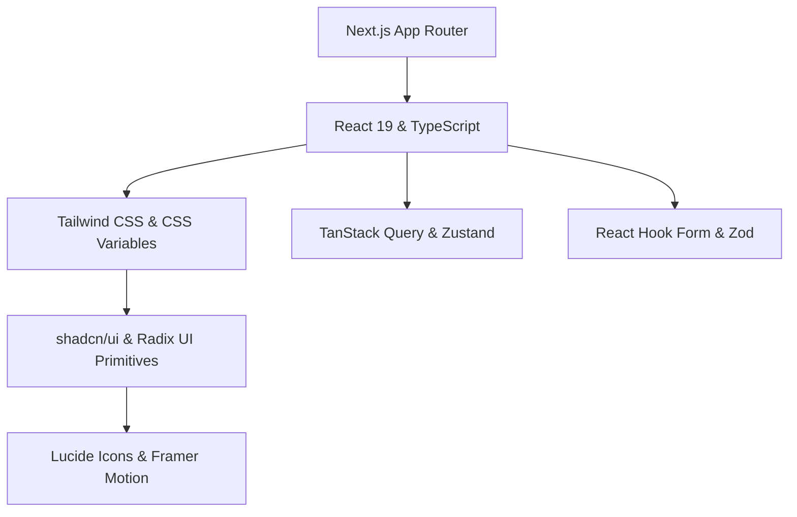

# 🎨 Design System & Architecture Specification (`DESIGN.md`)

> **Single Source of Truth (SSOT)**  
> Translations: [Korean (`DESIGN.ko.md`)](./DESIGN.ko.md) | [Simplified Chinese (`DESIGN.cn.md`)](./DESIGN.cn.md) | [Japanese (`DESIGN.jp.md`)](./DESIGN.jp.md)

This document defines the core architecture, design tokens, component standards, and development conventions for building modern web applications using **shadcn/ui**, **Tailwind CSS**, and **Next.js (App Router)**.

---

## 📋 Table of Contents

1. [Core Principles](#1-core-principles)
2. [Tech Stack & Architecture](#2-tech-stack--architecture)
3. [Design Tokens & Theme System](#3-design-tokens--theme-system)
4. [shadcn/ui Component Architecture](#4-shadcnui-component-architecture)
5. [Layout & Responsive Strategy](#5-layout--responsive-strategy)
6. [State Management & Data Flow](#6-state-management--data-flow)
7. [Development Conventions](#7-development-conventions)
8. [Setup & Quality Checklist](#8-setup--quality-checklist)

---

## 1. Core Principles

| Principle | Core Concept | Implementation Rule |
| :--- | :--- | :--- |
| **1. Ownership** | Code ownership over package lock-in | Own component source files directly in `components/ui` via `shadcn/ui` CLI. |
| **2. Accessibility First** | Inclusive UX out-of-the-box | Built on Radix UI Primitives adhering to WAI-ARIA standards with keyboard navigation & focus management. |
| **3. Token-Driven Styling** | Zero hardcoded colors/dimensions | Use CSS variable semantic tokens (`var(--primary)`, `var(--background)`) and Tailwind utility classes. |
| **4. Micro-Interactions** | High perceived performance | Subtle hover states (`transition-colors`, `active:scale-[0.99]`) and fluid animations via Framer Motion. |
| **5. Composition** | Flexible & extensible components | Adopt Radix `Slot` (`asChild`) and compound component patterns instead of rigid prop configurations. |

---

## 2. Tech Stack & Architecture

### Tech Stack Overview



- **Framework**: [Next.js (App Router)](https://nextjs.org/) + [React 19](https://react.dev/) + [TypeScript](https://www.typescriptlang.org/)
- **Styling**: [Tailwind CSS](https://tailwindcss.com/) + CSS Variables (OKLCH / HSL)
- **UI Primitives**: [shadcn/ui](https://ui.shadcn.com/) / [Radix UI](https://www.radix-ui.com/)
- **Utilities**: `clsx` + `tailwind-merge` (`cn()` helper), `class-variance-authority` (CVA)
- **Icons & Motion**: [Lucide React](https://lucide.dev/), [Framer Motion](https://www.framer.com/motion/)
- **Theme**: [next-themes](https://github.com/pacocoursey/next-themes) (Light / Dark / System)
- **Form & Validation**: [React Hook Form](https://react-hook-form.com/) + [Zod](https://zod.dev/)

### Directory Structure

```text
.
├── app/                      # App Router pages & layouts
│   ├── (dashboard)/          # Main application route group
│   ├── globals.css           # Global CSS & CSS Variable token definitions
│   └── layout.tsx            # Root layout with Theme & Query Providers
├── components/
│   ├── ui/                   # Atomic shadcn/ui primitives (button, card, dialog, etc.)
│   ├── common/               # Domain-agnostic components (header, sidebar, mode-toggle)
│   ├── features/             # Feature-specific domain components
│   └── providers/            # React context providers
├── hooks/                    # Reusable custom hooks
├── lib/                      # Utilities (utils.ts) & validations
└── types/                    # Shared TypeScript declarations
```

---

## 3. Design Tokens & Theme System

### 3.1 OKLCH / HSL Semantic Color Tokens

```css
@layer base {
  :root {
    --background: oklch(0.99 0 0);
    --foreground: oklch(0.14 0.005 285.8);
    --card: oklch(1 0 0);
    --card-foreground: oklch(0.14 0.005 285.8);
    --popover: oklch(1 0 0);
    --popover-foreground: oklch(0.14 0.005 285.8);
    --primary: oklch(0.21 0.006 285.8);
    --primary-foreground: oklch(0.98 0 0);
    --secondary: oklch(0.96 0.003 264.5);
    --secondary-foreground: oklch(0.21 0.006 285.8);
    --muted: oklch(0.96 0.003 264.5);
    --muted-foreground: oklch(0.55 0.013 285.8);
    --accent: oklch(0.96 0.003 264.5);
    --accent-foreground: oklch(0.21 0.006 285.8);
    --destructive: oklch(0.57 0.24 27.3);
    --destructive-foreground: oklch(0.98 0 0);
    --border: oklch(0.91 0.005 285.8);
    --input: oklch(0.91 0.005 285.8);
    --ring: oklch(0.70 0.015 285.8);
    --radius: 0.625rem;
  }

  .dark {
    --background: oklch(0.14 0.005 285.8);
    --foreground: oklch(0.98 0 0);
    --card: oklch(0.18 0.006 285.8);
    --card-foreground: oklch(0.98 0 0);
    --popover: oklch(0.18 0.006 285.8);
    --popover-foreground: oklch(0.98 0 0);
    --primary: oklch(0.98 0 0);
    --primary-foreground: oklch(0.21 0.006 285.8);
    --secondary: oklch(0.26 0.006 285.8);
    --secondary-foreground: oklch(0.98 0 0);
    --muted: oklch(0.26 0.006 285.8);
    --muted-foreground: oklch(0.70 0.015 285.8);
    --accent: oklch(0.26 0.006 285.8);
    --accent-foreground: oklch(0.98 0 0);
    --destructive: oklch(0.39 0.14 22.7);
    --destructive-foreground: oklch(0.98 0 0);
    --border: oklch(0.26 0.006 285.8);
    --input: oklch(0.26 0.006 285.8);
    --ring: oklch(0.44 0.01 285.8);
  }
}
```

### 3.2 Typography & Radius Scale

- **Fonts**: Inter / Outfit (Sans), Fira Code / JetBrains Mono (Code).
- **Radius Tokens**: `rounded-lg: var(--radius)`, `rounded-md: calc(var(--radius) - 2px)`, `rounded-sm: calc(var(--radius) - 4px)`.

---

## 4. shadcn/ui Component Architecture

### 4.1 Class Combination (`cn()`) & CVA Pattern

```typescript
// lib/utils.ts
import { clsx, type ClassValue } from "clsx";
import { twMerge } from "tailwind-merge";

export function cn(...inputs: ClassValue[]) {
  return twMerge(clsx(inputs));
}
```

```typescript
// CVA Variant Example
const buttonVariants = cva(
  "inline-flex items-center justify-center whitespace-nowrap rounded-md text-sm font-medium transition-colors focus-visible:outline-none focus-visible:ring-1 focus-visible:ring-ring disabled:pointer-events-none disabled:opacity-50 [&_svg]:pointer-events-none [&_svg]:size-4 [&_svg]:shrink-0 gap-2",
  {
    variants: {
      variant: {
        default: "bg-primary text-primary-foreground shadow hover:bg-primary/90",
        destructive: "bg-destructive text-destructive-foreground shadow-sm hover:bg-destructive/90",
        outline: "border border-input bg-background shadow-sm hover:bg-accent hover:text-accent-foreground",
        secondary: "bg-secondary text-secondary-foreground shadow-sm hover:bg-secondary/80",
        ghost: "hover:bg-accent hover:text-accent-foreground",
        link: "text-primary underline-offset-4 hover:underline",
      },
      size: {
        default: "h-9 px-4 py-2",
        sm: "h-8 rounded-md px-3 text-xs",
        lg: "h-10 rounded-md px-8",
        icon: "h-9 w-9",
      },
    },
    defaultVariants: { variant: "default", size: "default" },
  }
);
```

### 4.2 Polymorphism (`asChild`)

Use Radix `Slot` via `asChild` to pass styling & props directly to custom children without extra DOM wrappers:

```tsx
<Button asChild variant="outline">
  <Link href="/dashboard">Go to Dashboard</Link>
</Button>
```

### 4.3 Essential Component Catalog

| Category | Key Components | Purpose |
| :--- | :--- | :--- |
| **Form & Controls** | `Button`, `Input`, `Select`, `Checkbox`, `RadioGroup`, `Switch`, `Slider`, `Form` | Input capture & validation |
| **Overlays & Dialogs** | `Dialog`, `Sheet`, `AlertDialog`, `Popover`, `DropdownMenu`, `Tooltip` | Contextual modals & drawers |
| **Layout & Containers** | `Card`, `Sidebar`, `Accordion`, `Tabs`, `ScrollArea`, `Separator` | Page framing & content chunking |
| **Navigation** | `NavigationMenu`, `Breadcrumb`, `Pagination`, `Command` (`Cmd+K`) | App routing & command palette |
| **Data & Feedback** | `Table`, `Avatar`, `Badge`, `Skeleton`, `Sonner` (Toast), `Chart` | Data visualization & alerts |

---

## 5. Layout & Responsive Strategy

### 5.1 App Shell Architecture

```tsx
// app/(dashboard)/layout.tsx
import { SidebarProvider, SidebarTrigger } from "@/components/ui/sidebar";
import { AppSidebar } from "@/components/common/app-sidebar";

export default function DashboardLayout({ children }: { children: React.ReactNode }) {
  return (
    <SidebarProvider defaultOpen>
      <div className="flex min-h-screen w-full bg-background text-foreground">
        <AppSidebar />
        <div className="flex flex-1 flex-col overflow-hidden">
          <header className="flex h-16 items-center justify-between border-b px-6 bg-card/80 backdrop-blur-md sticky top-0 z-30">
            <SidebarTrigger />
          </header>
          <main className="flex-1 overflow-y-auto p-6 md:p-8">
            <div className="mx-auto max-w-7xl space-y-6">{children}</div>
          </main>
        </div>
      </div>
    </SidebarProvider>
  );
}
```

### 5.2 Breakpoints Matrix

| Breakpoint | Width | Strategy |
| :--- | :--- | :--- |
| **`sm`** | `>= 640px` | 2-column forms |
| **`md`** | `>= 768px` | Fixed sidebar panel (mobile `Sheet` hidden), 2-column cards |
| **`lg`** | `>= 1024px` | 3-column grids, data tables expanded |
| **`xl`** | `>= 1280px` | Max container alignment (`max-w-7xl`) |

---

## 6. State Management & Data Flow

### 6.1 Server vs Client Boundaries

- **Server Components (Default)**: Direct DB/API fetching, zero client bundle weight, SEO.
- **Client Components (`"use client"`)**: Interactive state (`useState`), event handlers (`onClick`), Radix UI portals/popups.

### 6.2 Form Handling Pattern (React Hook Form + Zod)

```tsx
"use client";

import { useForm } from "react-hook-form";
import { zodResolver } from "@hookform/resolvers/zod";
import * as z from "zod";
import { Form, FormField, FormItem, FormLabel, FormControl, FormMessage } from "@/components/ui/form";
import { Input } from "@/components/ui/input";
import { Button } from "@/components/ui/button";

const schema = z.object({
  username: z.string().min(2, "Min 2 characters required"),
});

export function ProfileForm() {
  const form = useForm<z.infer<typeof schema>>({
    resolver: zodResolver(schema),
    defaultValues: { username: "" },
  });

  return (
    <Form {...form}>
      <form onSubmit={form.handleSubmit(console.log)} className="space-y-4">
        <FormField
          control={form.control}
          name="username"
          render={({ field }) => (
            <FormItem>
              <FormLabel>Username</FormLabel>
              <FormControl><Input {...field} /></FormControl>
              <FormMessage />
            </FormItem>
          )}
        />
        <Button type="submit">Save</Button>
      </form>
    </Form>
  );
}
```

---

## 7. Development Conventions

1. **File Naming**: `kebab-case` for files (`user-card.tsx`), `PascalCase` for React components (`UserCard`), `camelCase` for hooks (`useDebounce`).
2. **Component Ref Forwarding**: Wrap custom components in `React.forwardRef` and attach `displayName`.
3. **Git Commits**: Use [Conventional Commits](https://www.conventionalcommits.org/) (`feat:`, `fix:`, `docs:`, `style:`, `refactor:`, `chore:`).

---

## 8. Setup & Quality Checklist

### Quick Setup CLI Commands

```bash
npx create-next-app@latest my-app --typescript --tailwind --eslint --app --import-alias="@/*"
npx shadcn@latest init
npx shadcn@latest add button card dialog form input select sidebar sonner table tabs
npm install lucide-react next-themes zod react-hook-form @hookform/resolvers class-variance-authority clsx tailwind-merge
```

### Quality Audit Checklist

- [ ] **Type Safety**: Zero `any` types.
- [ ] **Theme Compliance**: Clean light & dark contrast ratio (>= 4.5:1).
- [ ] **Accessibility (a11y)**: Full keyboard navigation & `sr-only` text for icon buttons.
- [ ] **Responsive Design**: Zero horizontal overflow across all screen sizes.
- [ ] **Token Usage**: Only CSS semantic variables (`bg-background`, `text-foreground`).
- [ ] **Polymorphism**: `asChild` used for links & buttons correctly.
