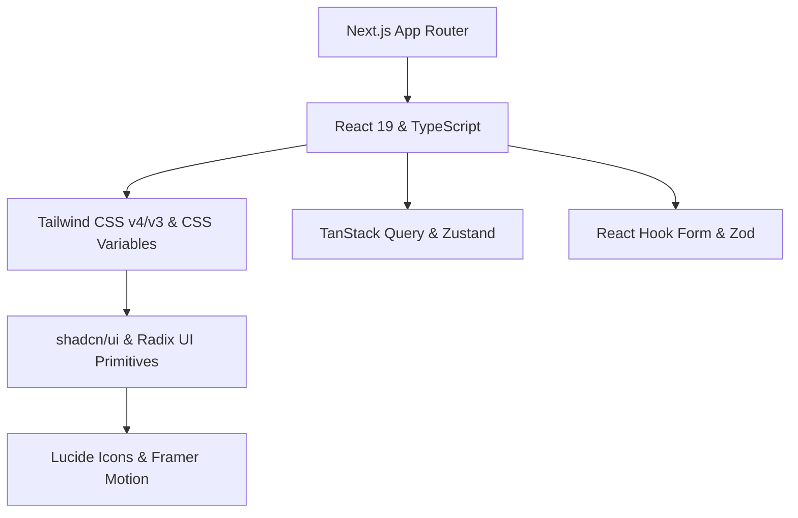

# 🎨 shadcn/ui 기반 웹 애플리케이션 디자인 시스템 & 아키텍처 명세서 (`design.md`)

본 문서는 **`shadcn/ui`** 및 **Tailwind CSS**를 기반으로 구축되는 모던 웹 애플리케이션의 디자인 시스템, UI/UX 규격, 컴포넌트 아키텍처 및 개발 표준 가이드를 정의합니다. 프로젝트 개발 과정에서 일관된 사용자 경험(UX), 확장 가능한 코드베이스, 그리고 뛰어난 시각적 완성도(Visual Excellence)를 유지하기 위한 단일 진실 출처(Single Source of Truth) 역할을 합니다.

---

## 📋 목차 (Table of Contents)

1. [프로젝트 개요 및 핵심 원칙 (Overview & Core Principles)](#1-프로젝트-개요-및-핵심-원칙-overview--core-principles)
2. [기술 스택 및 핵심 아키텍처 (Tech Stack & Core Architecture)](#2-기술-스택-및-핵심-아키텍처-tech-stack--core-architecture)
3. [디자인 토큰 & 테마 시스템 (Design Tokens & Theme System)](#3-디자인-토큰--테마-시스템-design-tokens--theme-system)
4. [shadcn/ui 컴포넌트 아키텍처 (Component Architecture)](#4-shadcnui-컴포넌트-아키텍처-component-architecture)
5. [레이아웃 & 정보 설계 (Layout & Information Architecture)](#5-레이아웃--정보-설계-layout--information-architecture)
6. [상태 관리 & 데이터 흐름 (State Management & Data Flow)](#6-상태-관리--데이터-흐름-state-management--data-flow)
7. [개발 표준 & 코딩 컨벤션 (Development Standards & Conventions)](#7-개발-표준--코딩-컨벤션-development-standards--conventions)
8. [프로젝트 셋업 및 품질 체크리스트 (Setup & Quality Checklist)](#8-프로젝트-셋업-및-품질-체크리스트-setup--quality-checklist)

---

## 1. 프로젝트 개요 및 핵심 원칙 (Overview & Core Principles)

### 1.1 프로젝트 비전 (Vision)
본 디자인 시스템은 사용자에게 **시각적 경이로움(Wow factor)**과 **직관적이고 매끄러운 UX**를 제공하며, 개발자에게는 **강력한 타입 안정성**과 **최고 수준의 개발 생산성**을 제공하는 것을 목표로 합니다.

### 1.2 5대 핵심 디자인 원칙 (Core Design Principles)

| 원칙 | 설명 | 적용 방식 |
| :--- | :--- | :--- |
| **1. Ownership (코드 소유권)** | 패키지 의존성에 갇히지 않고 코드 자체를 프로젝트 내부로 소유합니다. | `shadcn/ui` CLI를 통해 컴포넌트를 `components/ui`에 직접 복사하여 필요에 따라 커스텀 구현 |
| **2. Accessibility First (접근성 우선)** | 모든 사용자가 제약 없이 사용할 수 있는 UI를 구현합니다. | Radix UI Primitives 기반 WAI-ARIA 표준 준수, 키보드 내비게이션 및 포커스 링 관리 |
| **3. Design Token Consistency (토큰 일관성)** | 하드코딩된 색상/크기를 배제하고 CSS 변수 및 Tailwind 클래스를 사용합니다. | Semantic Color Tokens (`--primary`, `--background`, `--muted` 등) 중심 설계 |
| **4. Micro-Interactions & Motion (생동감)** | 정적인 화면을 피하고 매끄러운 트랜지션과 시각적 피드백을 제공합니다. | Framer Motion 및 Tailwind CSS animations 활용한 상태 전환 및 호버 애니메이션 |
| **5. Composition over Inheritance (조합성)** | 복잡한 단일 컴포넌트 대신 유연하고 합성 가능한 작은 조각들을 조합합니다. | Radix `Slot` (`asChild`) 및 Compound Component 패턴 적극 채택 |

---

## 2. 기술 스택 및 핵심 아키텍처 (Tech Stack & Core Architecture)

### 2.1 메인 기술 스택 (Tech Stack)



- **Core Framework**: [Next.js (App Router)](https://nextjs.org/) + [React 19](https://react.dev/) + [TypeScript](https://www.typescriptlang.org/)
- **Styling**: [Tailwind CSS](https://tailwindcss.com/) + CSS Variables (OKLCH / HSL)
- **UI Components**: [shadcn/ui](https://ui.shadcn.com/) (powered by [Radix UI Primitives](https://www.radix-ui.com/))
- **Utilities**: `clsx` + `tailwind-merge` (`cn()` helper), `class-variance-authority` (CVA)
- **Icons**: [Lucide React](https://lucide.dev/)
- **Theme**: [next-themes](https://github.com/pacocoursey/next-themes) (Light / Dark / System Mode 지원)
- **Form & Validation**: [React Hook Form](https://react-hook-form.com/) + [Zod](https://zod.dev/)
- **State Management**: [TanStack Query v5](https://tanstack.com/query) (서버 상태) + [Zustand](https://zustand-demo.pmnd.rs/) (전역 클라이언트 상태)

### 2.2 디렉토리 아키텍처 (Directory Structure)

```text
.
├── app/                      # Next.js App Router 페이지 및 레이아웃
│   ├── (auth)/               # 인증 관련 라우트 그룹
│   ├── (dashboard)/          # 대시보드 및 메인 앱 라우트 그룹
│   ├── api/                  # API Route Handlers
│   ├── globals.css           # 글로벌 CSS 및 CSS 변수 토큰 정의
│   ├── layout.tsx            # Root Layout (Theme, Query Provider 포함)
│   └── page.tsx              # 랜딩 / 메인 페이지
├── components/               # 재사용 가능한 UI 컴포넌트 모음
│   ├── ui/                   # shadcn/ui 원자적(Atomic) 컴포넌트 (Button, Dialog 등)
│   ├── common/               # 비즈니스 중립적 공통 컴포넌트 (Header, Footer 등)
│   ├── features/             # 도메인/기능별 특화 컴포넌트 (UserAvatar, PaymentCard 등)
│   └── providers/            # React Context Providers (ThemeProvider, QueryProvider 등)
├── config/                   # 앱 전역 설정 (site.ts, navigation.ts 등)
├── hooks/                    # 커스텀 커스텀 훅 (use-debounce.ts, use-media-query.ts 등)
├── lib/                      # 유틸리티 및 헬퍼 함수
│   ├── utils.ts              # cn() 함수 등 공통 유틸
│   └── validations/          # Zod 스키마 정의
├── types/                    # TypeScript 공통 타입 및 인터페이스
└── public/                   # 정적 자원 (이미지, 폰트, 파비콘)
```

---

## 3. 디자인 토큰 & 테마 시스템 (Design Tokens & Theme System)

`shadcn/ui`의 디자인 시스템은 **CSS 변수 기반의 시맨틱 토큰(Semantic Tokens)**을 채택하여 Light Mode와 Dark Mode 간의 전환을 매끄럽게 처리하고, 컴포넌트 레벨에서 하드코딩된 색상을 추상화합니다.

### 3.1 OKLCH / HSL 색상 변수 명세 (Color Tokens)

프로젝트에서는 최신 웹 표준인 **OKLCH** 또는 **HSL** 색상 공간을 사용하여 지각적으로 일관된 지각(Perceptual Uniformity) 및 매끄러운 그라데이션 변환을 구현합니다.

```css
/* app/globals.css 예시 명세 */
@layer base {
  :root {
    --background: oklch(0.99 0 0);           /* #ffffff / pure light */
    --foreground: oklch(0.14 0.005 285.8);   /* #09090b / deep zinc */

    --card: oklch(1 0 0);
    --card-foreground: oklch(0.14 0.005 285.8);

    --popover: oklch(1 0 0);
    --popover-foreground: oklch(0.14 0.005 285.8);

    --primary: oklch(0.21 0.006 285.8);       /* Deep slate/zinc primary */
    --primary-foreground: oklch(0.98 0 0);

    --secondary: oklch(0.96 0.003 264.5);     /* Soft gray highlight */
    --secondary-foreground: oklch(0.21 0.006 285.8);

    --muted: oklch(0.96 0.003 264.5);
    --muted-foreground: oklch(0.55 0.013 285.8);

    --accent: oklch(0.96 0.003 264.5);
    --accent-foreground: oklch(0.21 0.006 285.8);

    --destructive: oklch(0.57 0.24 27.3);     /* Vibrant alert red */
    --destructive-foreground: oklch(0.98 0 0);

    --border: oklch(0.91 0.005 285.8);
    --input: oklch(0.91 0.005 285.8);
    --ring: oklch(0.70 0.015 285.8);

    --chart-1: oklch(0.64 0.22 41.1);
    --chart-2: oklch(0.60 0.11 184.7);
    --chart-3: oklch(0.39 0.08 225.4);
    --chart-4: oklch(0.82 0.18 84.4);
    --chart-5: oklch(0.76 0.17 162.4);

    --sidebar-background: oklch(0.98 0 0);
    --sidebar-foreground: oklch(0.26 0.006 285.8);
    --sidebar-primary: oklch(0.21 0.006 285.8);
    --sidebar-primary-foreground: oklch(0.98 0 0);
    --sidebar-accent: oklch(0.96 0.003 264.5);
    --sidebar-accent-foreground: oklch(0.21 0.006 285.8);
    --sidebar-border: oklch(0.91 0.005 285.8);
    --sidebar-ring: oklch(0.70 0.015 285.8);

    --radius: 0.625rem;                      /* 10px base border-radius */
  }

  .dark {
    --background: oklch(0.14 0.005 285.8);   /* Dark background */
    --foreground: oklch(0.98 0 0);

    --card: oklch(0.18 0.006 285.8);
    --card-foreground: oklch(0.98 0 0);

    --popover: oklch(0.18 0.006 285.8);
    --popover-foreground: oklch(0.98 0 0);

    --primary: oklch(0.98 0 0);
    --primary-foreground: oklch(0.21 0.006 285.8);

    --secondary: oklch(0.26 0.006 285.8);
    --secondary-foreground: oklch(0.98 0 0);

    --muted: oklch(0.26 0.006 285.8);
    --muted-foreground: oklch(0.70 0.015 285.8);

    --accent: oklch(0.26 0.006 285.8);
    --accent-foreground: oklch(0.98 0 0);

    --destructive: oklch(0.39 0.14 22.7);
    --destructive-foreground: oklch(0.98 0 0);

    --border: oklch(0.26 0.006 285.8);
    --input: oklch(0.26 0.006 285.8);
    --ring: oklch(0.44 0.01 285.8);

    --chart-1: oklch(0.48 0.24 264.3);
    --chart-2: oklch(0.69 0.17 162.4);
    --chart-3: oklch(0.76 0.18 70.08);
    --chart-4: oklch(0.62 0.26 305.4);
    --chart-5: oklch(0.64 0.25 16.43);

    --sidebar-background: oklch(0.18 0.006 285.8);
    --sidebar-foreground: oklch(0.98 0 0);
    --sidebar-primary: oklch(0.48 0.24 264.3);
    --sidebar-primary-foreground: oklch(0.98 0 0);
    --sidebar-accent: oklch(0.26 0.006 285.8);
    --sidebar-accent-foreground: oklch(0.98 0 0);
    --sidebar-border: oklch(0.26 0.006 285.8);
    --sidebar-ring: oklch(0.44 0.01 285.8);
  }
}
```

### 3.2 시맨틱 토큰 매핑 매트릭스 (Semantic Token Mapping)

| 시맨틱 토큰 명 | 폰트/요소 용도 | Light Mode 느낌 | Dark Mode 느낌 |
| :--- | :--- | :--- | :--- |
| `bg-background` | 기본 뷰포트 / 문서 배경 | 순백색 / 클린 미색 | 은은한 딥 차콜/울트라 다크 |
| `text-foreground` | 메인 텍스트, 헤더 | 검정에 가까운 차콜 (`#09090b`) | 밝은 소프트 화이트 (`#fafafa`) |
| `bg-card` | 카드, 대화상자 컨테이너 | 순백색 패널 | 차콜 스틸 카드 |
| `bg-popover` | 드롭다운, 툴팁, 콤보박스 플로팅 레이어 | 돋보이는 플로팅 레이어 | 오버레이 포커스 레이어 |
| `bg-primary` | 핵심 버튼, 활성 탭, 강조 인디케이터 | 주 시선 집중 버튼 | 고대비 인디케이터 |
| `bg-muted` | 비활성 배경, 호버 피드백 레이어 | 연한 회색 트랙 | 다크 그레이 호버 |
| `text-muted-foreground` | 캡션, 보조 텍스트, 힌트 | 중간 톤 쿨 그레이 | 소프트 디밍 그레이 |
| `border` | 카드의 테두리, 구분선 | 얇은 미세 아웃라인 | 딥 다크 엣지 아웃라인 |
| `ring` | 키보드 포커스 링 인디케이터 | 선명한 파란/슬레이트 링 | 루미너스 링 |

### 3.3 타이포그래피 시스템 (Typography Hierarchy)

타이포그래피는 **Inter** 또는 **Outfit**과 같은 산세리프 폰트를 기본 세리프로 적용하며, 코드 영역은 **Fira Code** 또는 **JetBrains Mono**를 적용합니다.

```tsx
// typography 예시 매핑 가이드 (CVA 또는 Tailwind 클래스 사용)
const typographyVariants = {
  h1: "scroll-m-20 text-4xl font-extrabold tracking-tight lg:text-5xl",
  h2: "scroll-m-20 border-b pb-2 text-3xl font-semibold tracking-tight first:mt-0",
  h3: "scroll-m-20 text-2xl font-semibold tracking-tight",
  h4: "scroll-m-20 text-xl font-semibold tracking-tight",
  p: "leading-7 [&:not(:first-child)]:mt-6",
  blockquote: "mt-6 border-l-2 pl-6 italic text-muted-foreground",
  lead: "text-xl text-muted-foreground",
  large: "text-lg font-semibold",
  small: "text-sm font-medium leading-none",
  muted: "text-sm text-muted-foreground",
  code: "relative rounded bg-muted px-[0.3rem] py-[0.2rem] font-mono text-sm font-semibold",
};
```

### 3.4 둥글기 (Border Radius Tokens)

`--radius` 변수를 기준으로 비율 계산에 의해 컴포넌트 둥글기가 유기적으로 조절됩니다.

```css
/* Tailwind radius mapping */
--radius: 0.625rem; /* lg: 10px */
rounded-lg: var(--radius);                /* 10px */
rounded-md: calc(var(--radius) - 2px);     /* 8px */
rounded-sm: calc(var(--radius) - 4px);     /* 6px */
rounded-full: 9999px;
```

### 3.5 그림자 & 깊이감 (Elevation & Shadows)

다크 모드와 라이트 모드 모두에서 깊이감을 표현하기 위해 다층 레이어 그림자를 적용합니다.

- **`shadow-sm`**: 일반 버튼, 뱃지, 입력 폼 포커스 시 미세 입체감
- **`shadow-md`**: 드롭다운 메뉴, 콤보박스, 선택 상자
- **`shadow-lg`**: 모달(Dialog), 다이얼로그 플로팅 윈도우
- **`shadow-xl` / `shadow-2xl`**: 가짓수 많은 드로어(Sheet), 토스트 알림(Sonner)

