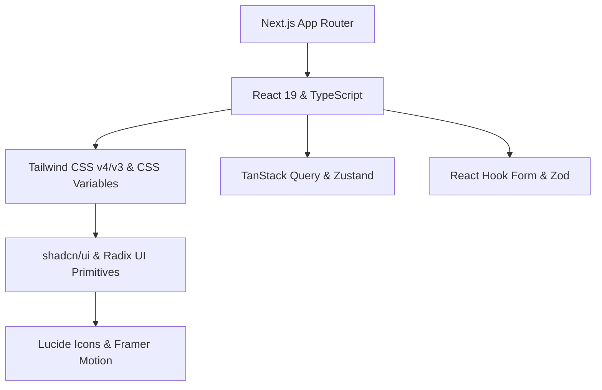

# 🎨 shadcn/ui 기반 웹 애플리케이션 디자인 시스템 & 아키텍처 명세서 (`design.md`)

본 문서는 **`shadcn/ui`** 및 **Tailwind CSS**를 기반으로 구축되는 모던 웹 애플리케이션의 디자인 시스템, UI/UX 규격, 컴포넌트 아키텍처 및 개발 표준 가이드를 정의합니다. 프로젝트 개발 과정에서 일관된 사용자 경험(UX), 확장 가능한 코드베이스, 그리고 뛰어난 시각적 완성도(Visual Excellence)를 유지하기 위한 단일 진실 출처(Single Source of Truth) 역할을 합니다.

---

## 📋 목차 (Table of Contents)

1. [프로젝트 개요 및 핵심 원칙 (Overview & Core Principles)](#1-프로젝트-개요-및-핵심-원칙-overview--core-principles)
2. [기술 스택 및 핵심 아키텍처 (Tech Stack & Core Architecture)](#2-기술-스택-및-핵심-아키텍처-tech-stack--core-architecture)
3. [디자인 토큰 & 테마 시스템 (Design Tokens & Theme System)](#3-디자인-토큰--테마-시스템-design-tokens--theme-system)
4. [shadcn/ui 컴포넌트 아키텍처 (Component Architecture)](#4-shadcnui-컴포넌트-아키텍처-component-architecture)
5. [레이아웃 & 정보 설계 (Layout & Information Architecture)](#5-레이아웃--정보-설계-layout--information-architecture)
6. [상태 관리 & 데이터 흐름 (State Management & Data Flow)](#6-상태-관리--데이터-흐름-state-management--data-flow)
7. [개발 표준 & 코딩 컨벤션 (Development Standards & Conventions)](#7-개발-표준--코딩-컨벤션-development-standards--conventions)
8. [프로젝트 셋업 및 품질 체크리스트 (Setup & Quality Checklist)](#8-프로젝트-셋업-및-품질-체크리스트-setup--quality-checklist)

---

## 1. 프로젝트 개요 및 핵심 원칙 (Overview & Core Principles)

### 1.1 프로젝트 비전 (Vision)
본 디자인 시스템은 사용자에게 **시각적 경이로움(Wow factor)**과 **직관적이고 매끄러운 UX**를 제공하며, 개발자에게는 **강력한 타입 안정성**과 **최고 수준의 개발 생산성**을 제공하는 것을 목표로 합니다.

### 1.2 5대 핵심 디자인 원칙 (Core Design Principles)

| 원칙 | 설명 | 적용 방식 |
| :--- | :--- | :--- |
| **1. Ownership (코드 소유권)** | 패키지 의존성에 갇히지 않고 코드 자체를 프로젝트 내부로 소유합니다. | `shadcn/ui` CLI를 통해 컴포넌트를 `components/ui`에 직접 복사하여 필요에 따라 커스텀 구현 |
| **2. Accessibility First (접근성 우선)** | 모든 사용자가 제약 없이 사용할 수 있는 UI를 구현합니다. | Radix UI Primitives 기반 WAI-ARIA 표준 준수, 키보드 내비게이션 및 포커스 링 관리 |
| **3. Design Token Consistency (토큰 일관성)** | 하드코딩된 색상/크기를 배제하고 CSS 변수 및 Tailwind 클래스를 사용합니다. | Semantic Color Tokens (`--primary`, `--background`, `--muted` 등) 중심 설계 |
| **4. Micro-Interactions & Motion (생동감)** | 정적인 화면을 피하고 매끄러운 트랜지션과 시각적 피드백을 제공합니다. | Framer Motion 및 Tailwind CSS animations 활용한 상태 전환 및 호버 애니메이션 |
| **5. Composition over Inheritance (조합성)** | 복잡한 단일 컴포넌트 대신 유연하고 합성 가능한 작은 조각들을 조합합니다. | Radix `Slot` (`asChild`) 및 Compound Component 패턴 적극 채택 |

---

## 2. 기술 스택 및 핵심 아키텍처 (Tech Stack & Core Architecture)

### 2.1 메인 기술 스택 (Tech Stack)



- **Core Framework**: [Next.js (App Router)](https://nextjs.org/) + [React 19](https://react.dev/) + [TypeScript](https://www.typescriptlang.org/)
- **Styling**: [Tailwind CSS](https://tailwindcss.com/) + CSS Variables (OKLCH / HSL)
- **UI Components**: [shadcn/ui](https://ui.shadcn.com/) (powered by [Radix UI Primitives](https://www.radix-ui.com/))
- **Utilities**: `clsx` + `tailwind-merge` (`cn()` helper), `class-variance-authority` (CVA)
- **Icons**: [Lucide React](https://lucide.dev/)
- **Theme**: [next-themes](https://github.com/pacocoursey/next-themes) (Light / Dark / System Mode 지원)
- **Form & Validation**: [React Hook Form](https://react-hook-form.com/) + [Zod](https://zod.dev/)
- **State Management**: [TanStack Query v5](https://tanstack.com/query) (서버 상태) + [Zustand](https://zustand-demo.pmnd.rs/) (전역 클라이언트 상태)

### 2.2 디렉토리 아키텍처 (Directory Structure)

```text
.
├── app/                      # Next.js App Router 페이지 및 레이아웃
│   ├── (auth)/               # 인증 관련 라우트 그룹
│   ├── (dashboard)/          # 대시보드 및 메인 앱 라우트 그룹
│   ├── api/                  # API Route Handlers
│   ├── globals.css           # 글로벌 CSS 및 CSS 변수 토큰 정의
│   ├── layout.tsx            # Root Layout (Theme, Query Provider 포함)
│   └── page.tsx              # 랜딩 / 메인 페이지
├── components/               # 재사용 가능한 UI 컴포넌트 모음
│   ├── ui/                   # shadcn/ui 원자적(Atomic) 컴포넌트 (Button, Dialog 등)
│   ├── common/               # 비즈니스 중립적 공통 컴포넌트 (Header, Footer 등)
│   ├── features/             # 도메인/기능별 특화 컴포넌트 (UserAvatar, PaymentCard 등)
│   └── providers/            # React Context Providers (ThemeProvider, QueryProvider 등)
├── config/                   # 앱 전역 설정 (site.ts, navigation.ts 등)
├── hooks/                    # 커스텀 커스텀 훅 (use-debounce.ts, use-media-query.ts 등)
├── lib/                      # 유틸리티 및 헬퍼 함수
│   ├── utils.ts              # cn() 함수 등 공통 유틸
│   └── validations/          # Zod 스키마 정의
├── types/                    # TypeScript 공통 타입 및 인터페이스
└── public/                   # 정적 자원 (이미지, 폰트, 파비콘)
```
